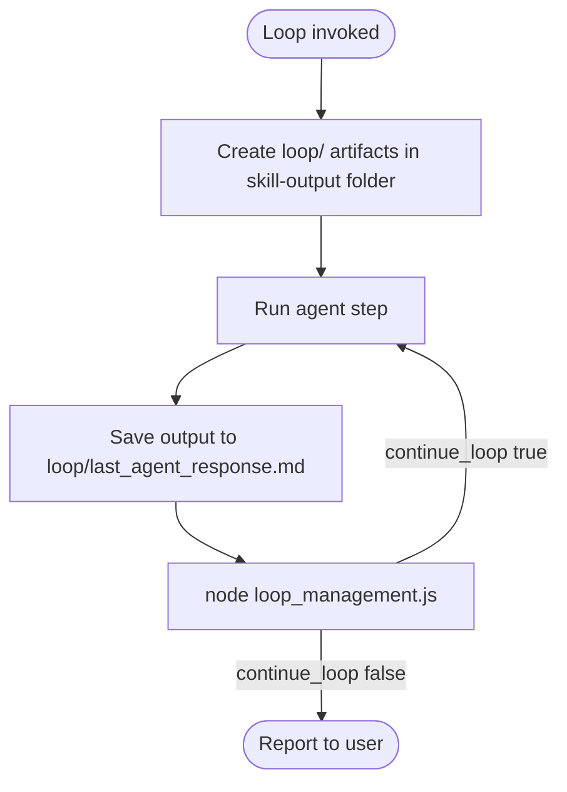

# Loop Management

Generic orchestration loop for Pixelanea agents. A **bash check script** inspects the **previous agent's response file**; **loop_management.js** runs that script and returns JSON `continue` or `stop`.

Aligns with the test-matrix orchestrator pattern ([orchestrate_unit_test_matrix.py](../../tools/orchestrate_unit_test_matrix.py)) but works for any loop goal.

All loop conditions and orchestration state live under `.cursor/skill-outputs/` per [skill-output-structure.mdc](../../rules/skill-output-structure.mdc) — inside the run folder's **`loop/`** subfolder.

## Quick start

1. **Scope** — Pick `{feature}`, `{layer}`, and a `{LOOP_NAME}` (kebab-case).
2. **Materialize the run folder and `loop/` subfolder**:

   ```text
   .cursor/skill-outputs/{feature}/{layer}/{timestamp}_loop-management/
     loop/
       loop_config.json
       check_condition.sh
       stop_condition.md
       last_agent_response.md
       loop_iteration.json   (created/updated by the tool)
   ```

3. **Define the bash stop check** — Copy [check_condition.template.sh](check_condition.template.sh) to `loop/check_condition.sh`, replace `{LOOP_NAME}`, and implement exit rules.
4. **Document the stop condition** — Copy [stop_condition.template.md](stop_condition.template.md) to `loop/stop_condition.md`; state what exit 0 means in one sentence.
5. **Define loop config** — Copy [loop_config.template.json](loop_config.template.json) to `loop/loop_config.json`; set paths (all under the same `loop/` folder) and `next_prompt`.
6. **After each agent step** — Save the agent output to `loop/last_agent_response.md`, then run the decision tool.
7. **Act on JSON** — If `continue_loop` is `true`, delegate again with `prompt`; if `false`, report to the user.

## Bash check script contract

Every `loop/check_condition.sh` must follow this contract:

| Exit code | Meaning | Orchestrator action |
|-----------|---------|---------------------|
| `0` | Stop condition **met** | **STOP** loop |
| non-zero | Stop condition **not met** | **CONTINUE** loop |

Environment variables set by the tool:

- `RESPONSE_FILE` — path to previous agent output (primary)
- `LOOP_RESPONSE_FILE` — same path (alias)

The script must read `${RESPONSE_FILE}` only; do not assume stdout from the previous agent is available elsewhere.

### Common check patterns

```bash
# Explicit completion marker in response
grep -qE '^\s*STATUS:\s*complete\s*$' "${RESPONSE_FILE}" && exit 0

# Phrase match (case-insensitive)
grep -qi 'all cases passed' "${RESPONSE_FILE}" && exit 0

# JSON flag (requires jq)
jq -e '.done == true' "${RESPONSE_FILE}" >/dev/null && exit 0

# File artifact exists (response points to output path)
artifact="$(grep -oE 'output: [^ ]+' "${RESPONSE_FILE}" | awk '{print $2}')"
[[ -n "${artifact}" && -f "${artifact}" ]] && exit 0

exit 1
```

## Loop config fields

| Field | Required | Purpose |
|-------|----------|---------|
| `name` | yes | Loop identifier |
| `check_script` | yes | Repo-relative path to `loop/check_condition.sh` |
| `response_file` | yes | Repo-relative path to `loop/last_agent_response.md` |
| `max_iterations` | no | Default `5`; cap before forced stop |
| `iteration_file` | no | Repo-relative path to `loop/loop_iteration.json` |
| `stop_reason` | no | Human reason when check exits 0 |
| `continue_reason` | no | Human reason when check exits non-zero |
| `next_prompt` | no | Prompt for the next subagent when continuing |

All paths in `loop_config.json` must stay under the same run folder's `loop/` directory.

## Decision tool

Run from repo root after saving the previous agent response:

```bash
node .cursor/tools/loop_management.js \
  --loop-config .cursor/skill-outputs/{feature}/{layer}/{timestamp}_loop-management/loop/loop_config.json
```

Override response path without editing config:

```bash
node .cursor/tools/loop_management.js \
  --loop-config path/to/loop/loop_config.json \
  --response-file path/to/loop/last_agent_response.md
```

Signal iteration cap (forces stop):

```bash
node .cursor/tools/loop_management.js \
  --loop-config path/to/loop/loop_config.json \
  --max-iterations-exceeded
```

**Output:** human banner on **stderr**, JSON decision on **stdout**.

### JSON fields (read these first)

| Field | Type | Meaning |
|-------|------|---------|
| `continue_loop` | boolean | `true` → delegate again; `false` → stop |
| `action` | `"continue"` \| `"stop"` | Same as `continue_loop` |
| `reason` | string | Why this decision was made |
| `iteration` | number | Current loop iteration |
| `max_iterations` | number | Cap from config |
| `check_exit_code` | number \| null | Bash script exit code |
| `prompt` | string \| null | Pass to next subagent when continuing |
| `action_summary` | string | One-line orchestrator instruction |

## Orchestration workflow

Copy and track progress:

```text
Loop progress:
- [ ] loop/ folder created under skill-output run folder
- [ ] loop_config.json, check_condition.sh, stop_condition.md materialized
- [ ] Bash check implements a clear stop condition (exit 0 = done)
- [ ] First agent step completed; response saved to loop/last_agent_response.md
- [ ] Decision tool run; JSON consumed
- [ ] Loop continues or stops per continue_loop
- [ ] Final status reported to user
```

### Decision loop

Repeat for up to `max_iterations`:

1. Run agent / subagent for this loop step.
2. Write full output to `loop/last_agent_response.md` (overwrite each iteration).
3. Run `loop_management.js` with `--loop-config` pointing at `loop/loop_config.json`.
4. If `continue_loop` is `true`:
   - Call Task (or next agent) with `prompt` from JSON.
   - Do **not** report completion to the user yet.
5. If `continue_loop` is `false`:
   - Stop and report `reason` plus any summary from the last response.



## Authoring a new loop (skill output)

When this skill sets up a loop, it must **output** these files under `loop/` in the skill-output run folder:

1. **`check_condition.sh`** — Full bash script with comments explaining each check.
2. **`loop_config.json`** — Valid config with all paths under the same `loop/` folder (no `{placeholders}`).
3. **`stop_condition.md`** — One sentence: what exit 0 means for this loop.

Optional: `01_setup-loop.md` at the run root for setup notes (numbered step pattern).

Make `check_condition.sh` executable:

```bash
chmod +x .cursor/skill-outputs/.../loop-management/loop/check_condition.sh
```

## Do not

- Store loop conditions outside `.cursor/skill-outputs/` or outside the run folder's `loop/` subfolder.
- Reverse the exit-code contract (exit 0 must mean **stop**, not continue).
- Skip writing `loop/last_agent_response.md` before running the decision tool.
- Edit `.cursor/tools/loop_management.js` for one-off loop logic — put checks in `loop/check_condition.sh`.
- Report loop completion while `continue_loop` is still `true`.

## Related

- Test-matrix orchestrator: `.cursor/tools/orchestrate_unit_test_matrix.py`
- Skill outputs layout: [skill-output-structure.mdc](../../rules/skill-output-structure.mdc)
