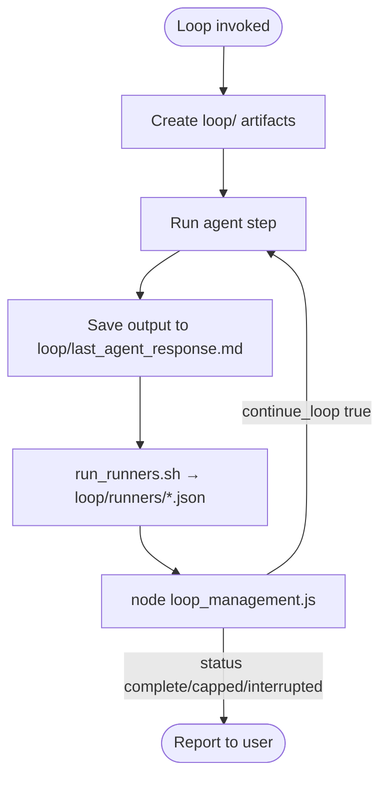

# Loop Management

Generic orchestration loop for Pixelanea agents. **Sensors** are CI runner artifacts under `loop/runners/` (written by `run_runners.sh`, not the model). **`loop_management.js`** runs `check_condition.sh` and returns JSON with `continue_loop` plus `status`: `complete` | `continue` | `capped` | `interrupted`.

`RESPONSE_FILE` / `loop/last_agent_response.md` is **critic and next-stroke context only** — never the stop bit. Ignore `EVALUATION`, `STATUS: complete`, and `UNRESOLVED_CRITICAL` for the conjunction.

Aligns with the test-matrix orchestrator pattern ([orchestrate_unit_test_matrix.py](../../tools/orchestrate_unit_test_matrix.py)) but works for any loop goal.

All loop conditions and orchestration state live under `.cursor/skill-outputs/` per [skill-output-structure.mdc](../../rules/skill-output-structure.mdc) — inside the run folder's **`loop/`** subfolder.

## Develop vs Deliver

| Loop | Required runners | Playwright |
|------|------------------|------------|
| **Develop** (recursive skill delivery) | `lint.json` + `unit.json` (optional backend unit in `unit.json`) | No |
| **Deliver** (in-house QA gate) | + `e2e.json` | Yes (`./scripts/ci.sh e2e`) |

Sensor catalog: [scripts/ci-steps/README.md](../../../scripts/ci-steps/README.md). Prefer `./scripts/ci.sh <step>` over inventing `npm run *`.

## Quick start

1. **Scope** — Pick `{feature}`, `{layer}`, and a `{LOOP_NAME}` (kebab-case).
2. **Materialize the run folder and `loop/` subfolder**:

   ```text
   .cursor/skill-outputs/{feature}/{layer}/{timestamp}_loop-management/
     loop/
       loop_config.json
       check_condition.sh
       stop_condition.md
       run_runners.sh          # optional wrapper → .cursor/tools/run_runners.sh
       last_agent_response.md
       loop_iteration.json     (created/updated by the tool)
       runners/
         lint.json
         unit.json
         e2e.json              # Deliver only
         summary.json
         logs/
   ```

3. **Define the bash stop check** — Copy [check_condition.template.sh](check_condition.template.sh) to `loop/check_condition.sh`, replace `{LOOP_NAME}`. Default reads `loop/runners/` via [check_runner_gate.js](../../tools/check_runner_gate.js).
4. **Document the stop condition** — Copy [stop_condition.template.md](stop_condition.template.md) to `loop/stop_condition.md`.
5. **Define loop config** — Copy [loop_config.template.json](loop_config.template.json); set `harness_profile` (`develop`|`deliver`), paths, and `next_prompt`.
6. **After each agent step** — Save agent output to `loop/last_agent_response.md`, then run the decision tool (it may invoke `run_runners.sh` when `summary.json` is stale).
7. **Act on JSON** — If `continue_loop` is `true`, delegate again with `prompt` + runner tails; if `false`, report `status` (`complete` ≠ `capped`).

**Token efficiency:** orchestrators pass the standard line in every worker Task prompt; workers use graphify → layer search → Read ([pixelanea-token-efficiency.mdc](../../rules/pixelanea-token-efficiency.mdc)).

## Bash check script contract

| Exit code | Meaning | `status` | Orchestrator action |
|-----------|---------|----------|---------------------|
| `0` | Required runners green | `complete` | **STOP** |
| `1` | At least one required runner red | `continue` | **CONTINUE** |
| `2` | Missing `runners/`, bad JSON, bad env | `interrupted` | **STOP** (fix artifacts) |

Cap is **not** an exit from `check_condition.sh`. When `max_iterations` is hit, `loop_management.js` sets `status: "capped"` and `continue_loop: false` without implying complete.

Environment variables set by the tool:

- `RESPONSE_FILE` / `LOOP_RESPONSE_FILE` — previous agent output (critic/context only)
- `RUNNERS_DIR` — path to `loop/runners/`
- `PIXELANEA_ROOT` — repo root (for locating `check_runner_gate.js`)

### Runner JSON shape

```json
{ "exit": 0, "log": "path/to/truncated/tail", "steps": ["03-lint", "04-typecheck"] }
```

`summary.json` holds the conjunction bit + `status`. Only `check_condition.sh` or `run_runners.sh` may write `loop/runners/*.json`. A file the actuator wrote is not a sensor reading.

### Preferred split

1. **`run_runners.sh`** (shared: `.cursor/tools/run_runners.sh`) executes CI steps and writes runner JSON. Timeout lives here.
2. **`check_condition.sh`** only **reads** those JSON files and exits 0/1/2.

Develop commands (from repo root):

```bash
./scripts/ci.sh 03-lint
./scripts/ci.sh 04-typecheck
./scripts/ci.sh 06-test-unit
# when server/ is in the batch:
./scripts/ci.sh 09-test-backend-unit
```

Deliver:

```bash
./scripts/ci.sh e2e
# or nightly smoke+race: ./scripts/ci.sh e2e-nightly
```

Do not run full Playwright inside the default recursive Develop `check_condition.sh`.

## Loop config fields

| Field | Required | Purpose |
|-------|----------|---------|
| `name` | yes | Loop identifier |
| `check_script` | yes | Repo-relative path to `loop/check_condition.sh` |
| `response_file` | yes | Repo-relative path to `loop/last_agent_response.md` |
| `max_iterations` | no | Default `5`; cap → `status: capped` |
| `iteration_file` | no | Repo-relative path to `loop/loop_iteration.json` |
| `harness_profile` | no | `develop` (default) or `deliver` |
| `auto_run_runners` | no | If true, invoke `run_runners.sh` when summary is stale |
| `include_backend` | no | Fold `09-test-backend-unit` into `unit.json` |
| `run_runners` | no | Path to writer, or `false` to disable |
| `stop_reason` | no | Human reason when check exits 0 |
| `continue_reason` | no | Human reason when check exits 1 |
| `next_prompt` | no | Prompt for the next subagent when continuing |

All paths in `loop_config.json` must stay under the same run folder's `loop/` directory.

## Decision tool

Run from repo root after saving the previous agent response:

```bash
node .cursor/tools/loop_management.js \
  --loop-config .cursor/skill-outputs/{feature}/{layer}/{timestamp}_loop-management/loop/loop_config.json
```

Force iteration cap (never reports `complete`):

```bash
node .cursor/tools/loop_management.js \
  --loop-config path/to/loop/loop_config.json \
  --max-iterations-exceeded
```

Skip re-running CI (read existing `loop/runners/` only):

```bash
node .cursor/tools/loop_management.js \
  --loop-config path/to/loop/loop_config.json \
  --skip-runners
```

**Output:** human banner on **stderr**, JSON decision on **stdout**.

### JSON fields (read these first)

| Field | Type | Meaning |
|-------|------|---------|
| `continue_loop` | boolean | `true` → delegate again; `false` → stop |
| `status` | `"complete"` \| `"continue"` \| `"capped"` \| `"interrupted"` | Exit class |
| `action` | `"continue"` \| `"stop"` | Same as `continue_loop` |
| `reason` | string | Why this decision was made |
| `iteration` | number | Current loop iteration |
| `max_iterations` | number | Cap from config |
| `check_exit_code` | number \| null | Bash script exit code |
| `prompt` | string \| null | Pass to next subagent when continuing |
| `action_summary` | string | One-line orchestrator instruction |

### Critic (optional)

Worker may write `CRITIC: PASS` or `CRITIC: FAIL` in `{NN}_code-review.md`. Feed critic into the **next** context after runner tails. Never AND a red runner into green. Recursive default: runners only.

### Context pack when continuing

Include, in order:

1. Setpoint (skill name, batch, frozen spec paths)
2. `loop/runners/summary.json`
3. Compressed tails of failing steps
4. Optional `CRITIC: FAIL` notes

Do not lead with a numeric EVALUATION.

## Orchestration workflow

```text
Loop progress:
- [ ] loop/ folder created under skill-output run folder
- [ ] loop_config.json, check_condition.sh, stop_condition.md materialized
- [ ] Bash check reads loop/runners/ (exit 0 = done)
- [ ] First agent step completed; response saved to loop/last_agent_response.md
- [ ] Decision tool run; JSON consumed (status distinguished)
- [ ] Loop continues or stops per continue_loop
- [ ] Final status reported to user (complete ≠ capped)
```



## Authoring a new loop (skill output)

When this skill sets up a loop, it must **output** these files under `loop/`:

1. **`check_condition.sh`** — Reader over `loop/runners/` (from template).
2. **`loop_config.json`** — Valid config with `harness_profile` and paths under the same `loop/` folder.
3. **`stop_condition.md`** — One sentence: exit 0 when required CI steps in `loop/runners/` are green.

Optional: copy [run_runners.template.sh](run_runners.template.sh); `01_setup-loop.md` at the run root.

```bash
chmod +x .cursor/skill-outputs/.../loop-management/loop/check_condition.sh
```

## Fixture tests

```bash
node .cursor/tools/check_runner_gate.test.js
```

Covers: all green → 0; any red → 1; EVALUATION 100 + red lint → 1; missing runners → 2; `--max-iterations-exceeded` → `status: capped`.

## Do not

- Store loop conditions outside `.cursor/skill-outputs/` or outside the run folder's `loop/` subfolder.
- Grep `EVALUATION` / `STATUS: complete` as the default stop bit.
- Treat cap as complete.
- Reverse the exit-code contract (exit 0 must mean **stop** / complete).
- Skip writing `loop/last_agent_response.md` before running the decision tool (still needed for context).
- Edit `.cursor/tools/loop_management.js` for one-off loop logic — put checks in `loop/check_condition.sh` / runners.
- Report loop completion while `continue_loop` is still `true`.
- Dump full Playwright traces into the next prompt window.

## Related

- Test-matrix orchestrator: `.cursor/tools/orchestrate_unit_test_matrix.py`
- CI step sensors: [scripts/ci-steps/README.md](../../../scripts/ci-steps/README.md)
- Skill outputs layout: [skill-output-structure.mdc](../../rules/skill-output-structure.mdc)
- Harness overview: [HARNESS.md](../../../HARNESS.md)
