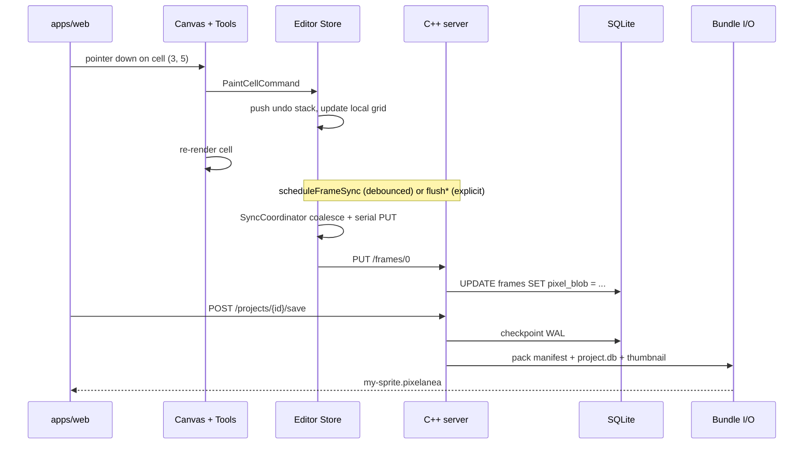
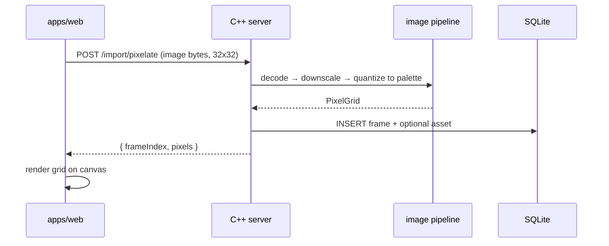

# Pixelanea Architecture

Pixelanea is a free, open-source, **local-only** pixel art editor. Users can pixelate images, draw on a canvas with custom palettes, undo painted cells, build 8/16/32-frame animations, preview playback, and save everything in a single portable project file.

This document describes the system architecture: a **React frontend**, a **C++ backend**, **SQLite** persistence, and a **monorepo** layout designed to stay modular and scalable.

---

## Goals

| Goal | Approach |
|------|----------|
| Run entirely offline | Backend binds to `127.0.0.1` only; no cloud dependency |
| Modular tools | Plugin-style tool interface in the frontend; domain logic in shared layers |
| Portable projects | One `.pixelanea` bundle per project (ZIP + SQLite + manifest) |
| Shareable artifacts | Export/import bundles with schema versioning and checksums |
| Performance | C++ handles image pixelation, persistence, and bundle I/O |
| Future scalability | Monorepo packages; optional desktop shell later |

---

## High-Level Overview

```
┌──────────────────────────────────────────────────────────────────────────┐
│                           apps/web (React)                               │
│  ┌─────────────┐  ┌──────────────┐  ┌─────────────┐  ┌────────────────┐  │
│  │   Toolbar   │  │ ColorPalette │  │ FramePicker │  │ AnimationPlayer│  │
│  └─────────────┘  └──────────────┘  └─────────────┘  └────────────────┘  │
│  ┌─────────────────────────────────────────────────────────────────────┐  │
│  │                     Canvas (HTML Canvas 2D)                          │  │
│  │              input routing → active Tool → Command dispatch          │  │
│  └─────────────────────────────────────────────────────────────────────┘  │
└───────────────────────────────────┬──────────────────────────────────────┘
                                    │ HTTP / WebSocket (localhost)
                                    │ contracts/ (OpenAPI → TS client)
┌───────────────────────────────────▼──────────────────────────────────────┐
│                         server/ (C++ backend)                            │
│  ┌──────────┐  ┌────────────┐  ┌──────────┐  ┌──────────┐  ┌─────────┐  │
│  │   API    │  │   Domain   │  │    DB    │  │  Export  │  │  Image  │  │
│  │  layer   │→ │   models   │→ │  repos   │  │  bundle  │  │ pipeline│  │
│  └──────────┘  └────────────┘  └────┬─────┘  └──────────┘  └─────────┘  │
└───────────────────────────────────────┼──────────────────────────────────┘
                                        │
                              ┌─────────▼─────────┐
                              │  SQLite (per      │
                              │  open project)    │
                              └───────────────────┘
```

**Dependency rule:** UI depends on API contracts; the C++ server depends on domain and persistence abstractions—not the other way around.

---

## Monorepo Layout

```text
pixelanea/
├── apps/
│   └── web/                      # React + Vite frontend
├── server/                       # C++ local HTTP server
│   ├── CMakeLists.txt
│   ├── src/
│   │   ├── api/                  # Route handlers, request validation
│   │   ├── domain/               # Project, Frame, Palette, PixelGrid
│   │   ├── db/                   # SQLite schema, migrations, repositories
│   │   ├── export/               # .pixelanea bundle pack/unpack
│   │   └── image/                # Image decode + pixelation
│   └── third_party/              # sqlite3, httplib, miniz, stb, etc.
├── contracts/
│   └── openapi.yaml              # Shared API contract (source of truth)
├── packages/                     # Optional shared TS packages (future)
│   └── api-client/               # Generated from OpenAPI
├── e2e/                          # Playwright E2E specs
├── scripts/
│   ├── dev.sh                    # Start C++ server + Vite dev server
│   ├── ci-sprint1.sh             # Sprint quality gate
│   └── e2e-webserver.sh          # Stack for Playwright
├── ARCHITECTURE.md
└── README.md
```

### Package responsibilities

| Path | Role |
|------|------|
| `apps/web` | Editor UI, canvas rendering, tool plugins, client-side undo stack |
| `server` | Persistence, project I/O, image processing, API surface |
| `contracts` | OpenAPI spec; generates TypeScript client for the frontend |
| `packages/api-client` | Typed fetch/WebSocket wrappers used by React |

---

## Runtime Model

### Local-only server

The C++ backend runs as a **local process** bound exclusively to `127.0.0.1`. The React app communicates over HTTP (REST for CRUD) and optionally WebSocket (animation preview streaming, import progress).

```text
Development:
  ./scripts/dev.sh
    → server listens on http://127.0.0.1:8787
    → Vite dev server on http://localhost:5173 (proxies /api → backend)

Production (future desktop shell):
  Launcher starts server binary + opens embedded or system browser
```

No authentication is required; the threat model assumes single-user local access.

---

## Frontend Architecture (`apps/web`)

### Layers

```text
pages/           → route-level composition
components/      → palette, toolbar, frame picker, animation controls
canvas/          → viewport, coordinate transforms, renderer
tools/           → paint, eraser, eyedropper, frame tools
state/           → editor store, sync coordinator, undo stack
api/             → generated client from contracts/openapi.yaml
```

`state/persist.ts` is the **only** entry point for scheduling or flushing backend writes. It delegates to `state/sync/SyncCoordinator` — see [Backend sync](#backend-sync-synccoordinator) below.

### Canvas

The canvas stays in the **browser** (HTML Canvas 2D) for responsive drawing and zoom/pan. It does not delegate per-pixel rendering to C++.

Responsibilities:

- World ↔ screen coordinate mapping (grid snap, zoom, pan)
- Render checkerboard, grid lines, pixels, onion-skin overlay
- Route pointer/keyboard events to the active tool
- Read-only mode during animation preview playback

### Tool plugin interface

Each editing tool is a self-contained module registered at startup:

```typescript
interface Tool {
  id: string;
  name: string;
  cursor: string;

  onActivate(ctx: ToolContext): void;
  onDeactivate(ctx: ToolContext): void;

  onPointerDown(e: PointerEvent, cell: CellCoord): Command | Command[] | void;
  onPointerMove(e: PointerEvent, cell: CellCoord): Command | Command[] | void;
  onPointerUp(e: PointerEvent, cell: CellCoord): Command | Command[] | void;

  onKeyDown?(e: KeyboardEvent, ctx: ToolContext): void;
}
```

`ToolContext` provides:

- Active palette color
- Current frame index
- `dispatch(command)` → updates in-memory grid + undo stack
- `readOnly` flag (enabled during preview)

### Built-in tools

| Tool | Behavior |
|------|----------|
| **Paint** | Sets cell to active palette color on click/drag |
| **Eraser** | Clears painted cells (sets to transparent / background) |
| **Eyedropper** | Picks color from canvas into active palette slot |
| **Frame duplicate** | Copies current art into an 8, 16, or 32 frame set |
| **Import pixelate** | Sends source image to backend; receives pixel grid |

Global **Undo** (Ctrl+Z) and **Redo** (Ctrl+Shift+Z) operate on a command stack in the frontend for instant feedback. The stack is flushed to the backend via the [sync coordinator](#backend-sync-synccoordinator) on save, frame switch, export, or debounced autosave.

### Backend sync (SyncCoordinator)

Local grid edits are instant; persistence to the C++ API is **asynchronous** and must not race. `state/sync/SyncCoordinator` serializes outbound `PUT` requests per resource key and coalesces rapid mutations into the latest snapshot.

```text
pointer → Tool → Command → editorStore.dispatch (local pixels + isDirty)
                                    ↓
                          persist.scheduleFrameSync()  ─┐
                          persist.schedulePaletteSync() ─┤ debounce 500ms
                                    ↓                    │
                          SyncCoordinator                │
                            ├── lane frame:{projectId}:{index}  (serial)
                            └── lane palette:{projectId}          (serial)
                                    ↓
                          api/frames.saveFrame | api/palette.savePalette
```

| Module | Role |
|--------|------|
| `state/persist.ts` | Public façade: `schedule*`, `flush*`, `reset` — **only** module that components/store call for backend sync |
| `state/sync/syncCoordinator.ts` | Debounce, per-key queue, in-flight coalescing, epoch reset |
| `state/sync/snapshots.ts` | Clone frame/palette buffers from `editorStore` (no aliasing live memory) |
| `state/sync/types.ts` | `SyncKey`, snapshot types, `SYNC_DEBOUNCE_MS` |

**Lane rules:**

- One in-flight HTTP request per key (`frame:proj:0`, `palette:proj`).
- Edits during an in-flight `PUT` **replace** the pending snapshot (latest-wins); no parallel writes for the same key.
- Frame and palette lanes may run **in parallel** (different keys).
- Always send **full** frame blobs and palette arrays — no partial PATCH.

**When to use `schedule*` vs `flush*`:**

| Situation | API | Why |
|-----------|-----|-----|
| Paint, undo, redo, palette edit | `scheduleFrameSync()` / `schedulePaletteSync()` | Debounce bursts; coalesce under load |
| Frame switch, reload frames | `flushFrameSync()` | Must persist active frame before loading another |
| Save / Save As bundle | `flushAllSync()` | Bundle must reflect latest frame + palette |
| Export spritesheet / GIF, start playback | `flushFrameSync()` | Downstream reads need committed grid |
| Open / new project | `resetPersistState()` | Cancel timers; invalidate in-flight callbacks |
| Immediate palette save button | `flushPaletteSync()` | User expects instant persist |

**Do not:** call `api/frames.saveFrame` or `api/palette.savePalette` from components, tools, or canvas. **Do not:** add per-component debounce timers or `setTimeout` for autosave.

### Animation preview

`AnimationPlayer` cycles frames `0 … n-1` at a configurable FPS with play/pause and loop. During playback the canvas enters read-only mode; the active frame index is driven by the player, not user edits.

---

## Backend Architecture (`server/`)

### Module boundaries

```text
api/        HTTP routing, JSON serialization, error responses
domain/     Pure business logic (no SQL, no HTTP)
db/         Repositories, migrations, connection management
export/     .pixelanea bundle create, validate, extract
image/      stb_image decode, downscale, palette quantization
```

### Domain model

```text
Project
├── id, name, schemaVersion
├── canvas: { width, height, cellSize }
├── palette: Palette
├── animation: { frameCount: 8|16|32, fps }
├── frames: Frame[]
└── metadata: { author?, tags?, thumbnail? }

Frame
├── index: number
├── width, height
└── pixels: compressed blob (palette indices or RGBA)

Palette
├── id, name
└── colors: { slot, hex, name? }[]

Command (serialized for optional server-side history)
├── paintCell(x, y, previous, next)
├── clearCell(x, y, previous)
└── importPixels(frameIndex, blob)
```

### Repository pattern

Persistence is accessed only through repositories—never from route handlers directly:

```cpp
class ProjectRepository {
public:
    ProjectHandle open(const std::filesystem::path& dbPath);
    void save(ProjectHandle& handle);
    void close(ProjectHandle& handle);
};

class FrameRepository {
public:
    Frame get(ProjectId id, int frameIndex);
    void put(ProjectId id, const Frame& frame);
    void duplicateAll(ProjectId id, int targetCount);
};
```

---

## Persistence (SQLite)

Each open project maps to **one SQLite database file**. At runtime the DB may live in a temp directory (when opened from a bundle) or directly on disk (when working with an extracted project).

### Schema (initial)

```sql
-- Versioning
CREATE TABLE app_meta (
    key   TEXT PRIMARY KEY,
    value TEXT NOT NULL
);

-- Project settings
CREATE TABLE projects (
    id           TEXT PRIMARY KEY,
    name         TEXT NOT NULL,
    width        INTEGER NOT NULL,
    height       INTEGER NOT NULL,
    frame_count  INTEGER NOT NULL DEFAULT 1,  -- 1, 8, 16, or 32
    fps          REAL NOT NULL DEFAULT 8.0,
    cell_size    INTEGER NOT NULL DEFAULT 16,
    created_at   TEXT NOT NULL,
    updated_at   TEXT NOT NULL
);

-- Palettes
CREATE TABLE palettes (
    id         TEXT PRIMARY KEY,
    project_id TEXT NOT NULL REFERENCES projects(id),
    name       TEXT NOT NULL,
    is_default INTEGER NOT NULL DEFAULT 0
);

CREATE TABLE palette_colors (
    palette_id  TEXT NOT NULL REFERENCES palettes(id),
    slot        INTEGER NOT NULL,
    hex         TEXT NOT NULL,
    name        TEXT,
    sort_order  INTEGER NOT NULL,
    PRIMARY KEY (palette_id, slot)
);

-- Animation frames
CREATE TABLE frames (
    project_id   TEXT NOT NULL REFERENCES projects(id),
    frame_index  INTEGER NOT NULL,
    width        INTEGER NOT NULL,
    height       INTEGER NOT NULL,
    pixel_blob   BLOB NOT NULL,       -- compressed grid data
    updated_at   TEXT NOT NULL,
    PRIMARY KEY (project_id, frame_index)
);

-- Imported source assets (optional)
CREATE TABLE assets (
    id         TEXT PRIMARY KEY,
    project_id TEXT NOT NULL REFERENCES projects(id),
    mime       TEXT NOT NULL,
    filename   TEXT,
    data       BLOB NOT NULL,
    created_at TEXT NOT NULL
);
```

### Pixel blob format

Frames are stored as compressed blobs to keep DB size small:

- **Encoding:** palette index per cell (1 byte if ≤256 colors) or RGBA
- **Compression:** RLE or LZ4 over the raw grid bytes
- **Checksum:** optional CRC32 stored in `app_meta` for integrity checks

For a 64×64 grid with 32 frames, this remains well under 1 MB.

### Migrations

Schema changes are versioned in `server/db/migrations/`:

```text
001_initial.sql
002_add_assets_table.sql
...
```

`app_meta.schema_version` drives migration on open. Old project files are upgraded automatically when possible.

---

## Project File Format (`.pixelanea`)

A `.pixelanea` file is a **ZIP archive**—one portable artifact for sharing, backup, and import.

```text
my-sprite.pixelanea/
├── manifest.json       # format version, checksums, compatibility
├── project.db          # SQLite database (canonical data)
├── thumbnail.png       # optional 128×128 preview
└── assets/             # optional imported source images
    └── reference.png
```

### manifest.json

```json
{
  "format": "pixelanea-bundle",
  "formatVersion": 1,
  "appMinVersion": "1.0.0",
  "projectId": "550e8400-e29b-41d4-a716-446655440000",
  "projectName": "my-sprite",
  "createdAt": "2026-07-31T00:00:00Z",
  "updatedAt": "2026-07-31T12:00:00Z",
  "checksums": {
    "project.db": "sha256:abc123...",
    "thumbnail.png": "sha256:def456..."
  }
}
```

### Lifecycle

| Action | Flow |
|--------|------|
| **Create** | Backend creates empty `project.db` → returns project handle |
| **Save** | Write DB → pack ZIP atomically (`*.tmp` → rename) |
| **Open** | Unpack ZIP to temp dir → validate manifest + checksums → migrate schema → attach DB |
| **Export** | Same as save; user picks destination path |
| **Import** | Validate bundle → copy to projects directory or open in place |
| **Extract** | Unpack bundle to a folder (for inspection or version control) |

---

## API Surface (`contracts/openapi.yaml`)

The OpenAPI spec is the **single source of truth** for frontend/backend contract. The TypeScript client is generated from it.

### Projects

```http
POST   /api/projects                    Create new project
POST   /api/projects/open               Open from path or uploaded bundle
GET    /api/projects/{id}               Get project metadata
PATCH  /api/projects/{id}               Update name, fps, canvas settings
POST   /api/projects/{id}/save          Save to path (write .pixelanea bundle)
POST   /api/projects/{id}/export        Export bundle to destination
POST   /api/projects/import             Import bundle from upload/path
DELETE /api/projects/{id}               Close and release resources
```

### Frames

```http
GET    /api/projects/{id}/frames              List frame metadata
GET    /api/projects/{id}/frames/{index}     Get frame pixel data
PUT    /api/projects/{id}/frames/{index}     Replace frame pixel data
POST   /api/projects/{id}/frames/duplicate    Copy current frame into 8|16|32 set
```

### Palettes

```http
GET    /api/projects/{id}/palette           Get default palette
PUT    /api/projects/{id}/palette           Replace palette colors
```

### Image processing

```http
POST   /api/projects/{id}/import/pixelate
  Body: { assetId | imageUpload, targetWidth, targetHeight, maxColors? }
  Response: { frameIndex, width, height, pixels }
```

### Animation preview (optional WebSocket)

```http
WS     /api/projects/{id}/preview
  → server streams { frameIndex, pixels } at requested FPS
  ← client sends { action: "play"|"pause"|"stop", fps, loop }
```

### Health

```http
GET    /api/health                          { status: "ok", version: "1.0.0" }
```

---

## Data Flow

### Paint → undo → save → share



### Import image → pixelate



---

## Undo / Redo

Undo is **client-side** for responsiveness:

```typescript
interface Command {
  execute(state: EditorState): void;
  undo(state: EditorState): void;
}

// Example
class PaintCellCommand implements Command {
  constructor(
    readonly x: number,
    readonly y: number,
    readonly previous: string | null,
    readonly next: string | null,
  ) {}
  // execute / undo swap previous ↔ next
}
```

- Stack cap: 500 commands (configurable)
- Eraser tool produces `ClearCellCommand` (same undo path as paint)
- Save/autosave persists the **resulting grid**, not the full command history (via `SyncCoordinator`; see [Backend sync](#backend-sync-synccoordinator))
- Optional future: `history_checkpoints` table for session recovery

---

## Animation System

### Frame setup

1. User draws base art on frame 0 (or imports a pixelated image).
2. User selects **8, 16, or 32** frames via the frame tool.
3. Backend duplicates frame 0 into all slots (or leaves others blank—configurable).
4. User switches frames in the UI and edits each independently.

### Playback

- `AnimationPlayer` reads frames from local cache (synced from backend on frame switch).
- Playback uses `requestAnimationFrame` with FPS timing.
- Onion-skin overlay (optional): render frame `n-1` at 30% opacity while editing frame `n`.

---

## Technology Choices

| Component | Choice | Rationale |
|-----------|--------|-----------|
| Frontend | React + Vite + TypeScript | Fast dev, rich ecosystem, canvas integration |
| Backend | C++17+ | Performance for image work and native SQLite |
| HTTP server | cpp-httplib or Drogon | Lightweight, embeddable, localhost-only |
| Database | SQLite 3 | Single-file, zero-config, portable |
| Bundle format | ZIP (miniz / libzip) | Universal, supports manifest + assets |
| Image I/O | stb_image | Header-only, easy to embed |
| API contract | OpenAPI 3.1 | Generates typed TS client |
| Monorepo | pnpm workspaces (web) + CMake (server) | Clear separation, independent builds |
| Build deps | vcpkg or Conan | Reproducible C++ dependency management |

---

## Scalability & Extension Points

The architecture supports growth without rewrites:

| Future capability | How to add |
|-------------------|------------|
| Desktop app (Tauri/Electron) | Shell launches `server` binary + embeds `apps/web` build |
| CLI exporter | `pixelanea export project.pixelanea --format png` using `server/export` |
| Plugin tools | Register new `Tool` implementations in `apps/web/tools/` |
| Layers | Add `layers` table; extend `Frame` with `layer_id` |
| GIF/spritesheet export | New `server/export` encoder; no UI rewrite |
| Cloud sync (if ever needed) | New `persistence` adapter behind repository interface |

---

## Testing

Pixelanea uses three complementary test layers:

| Layer | Location | Command | Purpose |
|-------|----------|---------|---------|
| Unit / integration | `apps/web/src/**/*.test.{ts,tsx}`, `server/` Catch2 | `pnpm test` | Tools, hooks, API wrappers, domain |
| QA matrices | `apps/web/src/qa/*Matrix.test.tsx` | `vitest run src/qa/` | Route guards, import wizard, I/O, animation regressions |
| E2E | `e2e/*.spec.ts` | `pnpm test:e2e` | Browser smoke (`@smoke`) and navigation (`@routing`) |

Playwright starts the stack via `scripts/e2e-webserver.sh` (C++ API + Vite). The sprint gate script `scripts/ci-sprint1.sh` runs typecheck, QA matrices, unit tests, optional E2E, and backend tests locally.

Post-MVP UI surfaces are gated in `apps/web/src/content/features.ts` so E2E and manual QA target the minimal shipping chrome by default.

---

## Development Workflow

```bash
# Install frontend deps
cd apps/web && pnpm install

# Build C++ server (first time)
cd server && cmake -B build && cmake --build build

# Start both (from repo root)
./scripts/dev.sh
```

`dev.sh` starts the C++ server on port `8787` and Vite on port `5173` with `/api` proxied to the backend.

---

## Build Order (recommended)

1. `contracts/openapi.yaml` — define API surface
2. `server/db` — schema, migrations, repositories
3. `server/api` — project CRUD, frame GET/PUT
4. `apps/web` — canvas render, paint tool, palette UI
5. Undo/redo command stack
6. Image pixelate endpoint + import UI
7. Frame duplication (8/16/32) + frame picker
8. Animation preview player
9. `.pixelanea` bundle export/import
10. README, polish, desktop shell (optional)

---

## Security & Privacy

- Backend listens on `127.0.0.1` only; not exposed to the network.
- No telemetry, accounts, or external services.
- Project bundles contain only art data; safe to share.
- Import validates manifest version and checksums before opening.
- Path traversal is rejected when unpacking bundles.

---

## Glossary

| Term | Definition |
|------|------------|
| **Pixel grid** | 2D array of palette indices or colors representing one frame |
| **Frame** | One animation cel; projects have 1, 8, 16, or 32 frames |
| **Palette** | Ordered list of colors available for drawing |
| **Bundle** | `.pixelanea` ZIP archive containing DB + manifest |
| **Command** | Reversible edit operation (paint, clear) for undo/redo |
| **Tool** | UI interaction mode (paint, eraser, eyedropper, etc.) |
