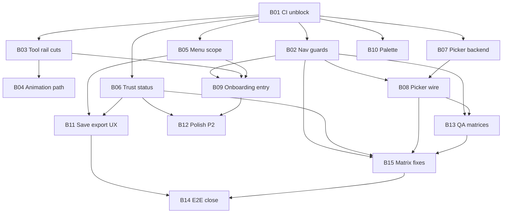

# Sprint 1 — MVP Trust & Flow Hardening

Sprint backlog derived from:

- [MVP UX/UI critique](.cursor/changelog/mvp/20260731T234500_uxui-design-critique/uxui_design_critique.md) (Maya, Leo, Esteban) — recommendations **#1–#11**
- [QA E2E run report](.cursor/changelog/mvp/20260731T234157_qa-e2e-gherkin/qa_run_report.md) (2026-07-31 — feature rollup: **red**)
- [QA unit matrix pass](.cursor/skill-outputs/qa/) (2026-08-01 — `skill-unit-test-matrix` on QA-001–004; **67 cases executed**, deviations triaged below)

**Related:** [BACKLOG.md](./BACKLOG.md) · [PRACTICES.md](./PRACTICES.md) · [UX.md](./UX.md) · [DESIGN.md](./DESIGN.md) · [Gherkin](.cursor/changelog/mvp/20260731T234157_qa-e2e-gherkin/gherkin.md)

---

## Sprint goal

Make the **implemented** MVP shippable for Riley, Casey, and Morgan by:

1. **Fixing every red QA flag** and every critique **P0** item
2. **Cutting** redundant/broken flows and post-MVP chrome bloat (net-negative LOC where possible)
3. **Surfacing** save/sync trust state users can read at a glance
4. **Replacing** manual path typing with native file pickers (desktop-first)
5. **Guiding** Riley to animation without duplicate create-time UI
6. **Shipping pristine code** — strict layers, pure derivations, full test coverage on touched paths, zero CI noise

**Non-goals this sprint:** layers, tilemaps, cloud sync, marketing site, new drawing tools, arbitrary frame counts, PNG sequence import.

---

## Code quality charter (non-negotiable)

Every ticket in this sprint must satisfy [PRACTICES.md](./PRACTICES.md). No exceptions.

### Architecture

| Rule | Enforcement |
|------|-------------|
| Dependency direction | `pages` → `shell`/`components` → `state` → `api` → OpenAPI. **Never** reverse. |
| No backend leakage in UI | No SQLite, ZIP, blob encoding, hand-rolled fetch DTOs in React. |
| Coordinate math | Only in `canvas/coordinates.ts` and callers in `canvas/`. |
| Tools | Paint ops = `Tool` + `Command` via `dispatch`. Chrome actions (duplicate, file) **not** fake tools. |
| Copy | All user strings in `content/` (`copy.ts`, `errors.ts`). |
| Tokens | Chrome = semantic tokens; canvas = functional tokens only. |
| OpenAPI | Contract change → regenerate `packages/api-client` → backend builds. |

### Code style

| Rule | How we verify |
|------|----------------|
| TypeScript `strict` | `pnpm --filter web exec tsc --noEmit` |
| Pure derivations | Status, guards, file-picker tiers = pure functions in `lib/` + unit tests. No React in derive logic. |
| Narrow selectors | Zustand: subscribe to fields needed; no whole-store subscriptions in hot paths. |
| Result types | Async I/O returns `{ ok: true, … } \| { ok: false, message }` — no thrown errors across layer boundaries. |
| No dead code | Delete unused exports; grep after each ticket (see [Dead code checklist](#dead-code-removal-checklist)). |
| Comments | **Why** only (debounce ms, priority order in `deriveProjectStatus`). |
| Confirm dialogs | Radix `Dialog` for discard/save prompts — **not** `window.confirm` (S1-205). |

### Performance (regression budget)

| Area | Budget | Ticket |
|------|--------|--------|
| Paint drag | No await on pointer path | Maintain — do not add sync I/O to tools |
| Health check | **1×** per app load | S1-102 |
| Palette panel mount | No shading/filters DOM until accordion open | S1-501, S1-801 |
| Animation play | Prefetch ≤8 frames parallel OK; throttle only if profiled | S1-803 optional |
| File dialog | Single round-trip; no polling | S1-302 |
| Status bar | `deriveProjectStatus` O(1); memoize in hook | S1-201 |

### Accessibility (touched surfaces)

- Icon + label on tools ([DESIGN.md](./DESIGN.md)); active = accent + 3px border + weight, not hue alone.
- `aria-pressed`, `aria-live` on status/toast; focus rings from `focus-ring` token.
- Keyboard path preserved for every removed menu item (undo stays on toolbar + shortcuts).
- 14px body minimum; 40×40 touch targets on new buttons.

### Per-PR quality gate (required before merge)

```bash
# From repo root — all must pass
pnpm --filter web exec tsc --noEmit
pnpm --filter web test                    # exit 0 — includes S1-106 fix
# If server/OpenAPI touched:
cmake --build server/build && ./server/build/pixelanea_tests
# Regenerate client if openapi.yaml changed:
pnpm run generate:api-client              # or project script name
```

- [ ] Diff is scoped to ticket; no drive-by refactors
- [ ] New logic has unit tests (happy + at least one edge/error)
- [ ] No inline user-facing strings
- [ ] No `any`; no `@ts-ignore` without linked issue
- [ ] Critique # / QA matrix ID in PR title or description
- [ ] Dead code from ticket removed in same PR

---

## Ship gate (sprint exit criteria)

| # | Criterion | Persona | How we verify |
|---|-----------|---------|---------------|
| G1 | Open/Save/Save As via **native picker** on desktop Linux | Morgan | Workshop dry-run: 5 users, zero typed paths |
| G2 | Status bar answers **“is my work saved?”** | All | `deriveProjectStatus` tests + manual |
| G3 | Riley finds **Duplicate frames** in &lt; 2 min | Riley | Timed task + SM1-05 |
| G4 | No dead tools in rail | All | SM1-01 |
| G5 | File menu **Export PNG** only (flags off) | Scope | SM1-10 |
| G6 | `pnpm --filter web test` **exit 0** | Eng | CI |
| G7 | Import wizard ≤ 5 min unchanged | Casey | Timed + QA-002 matrix |
| G8 | **Unsaved guard** on New, Open, Import, `beforeunload` | All | SM1-14, S1-908, **S1-911**, gherkin `@routing` |
| G9 | QA rollup **not red** — 0 🔴 | Eng | Re-run `qa-gherkin-run` |
| G10 | Critique mistakes checklist **≥ 6/8** checked | UX | [Re-audit](#sprint-close-re-audit) |
| G11 | **Net LOC ≤ +5%** vs sprint start (deletions count) | Eng | `git diff --stat` sprint baseline |
| G12 | Backend + frontend **ctest/vitest** green | Eng | CI |
| G13 | QA matrix harnesses **0 `[!]`** | Eng | `src/qa/*Matrix`, S1-919 |

---

## Full coverage matrix

Every critique item, QA red/yellow, and ux-seamless-flows mistake maps to a ticket.

### Critique recommendations → tickets

| # | Recommendation | Ticket(s) | Priority |
|---|----------------|-----------|----------|
| C1 | Native file picker | S1-301, S1-302, S1-303 | P0 |
| C2 | Project status in chrome | S1-201, S1-202, S1-204 | P0 |
| C3 | Surface animation earlier | S1-103, S1-401, S1-402 | P0/P1 |
| C4 | Collapse palette power tools | S1-501, S1-801 | P1 |
| C5 | Reposition onboarding step 2 | S1-402 | P1 |
| C6 | Export toasts | S1-601 | P1 |
| C7 | Save As asset type default | S1-503 | P1 |
| C8 | Remove Import tool | S1-101, S1-804, S1-604 | P0/P2 |
| C9 | Single animation path | S1-103 | P0 |
| C10 | Dedupe health check | S1-102 | P1 |
| C11 | Hide GIF/spritesheet/onion | S1-104 | P1 |

### UX seamless-flows mistakes → tickets

| Mistake | Sprint target | Ticket(s) |
|---------|---------------|-----------|
| #1 Unclear primary action | Save visible in header | S1-701 |
| #2 Hidden system state | Status bar + sync | S1-201, S1-202 |
| #3 Modal / flow break | Unsaved guards | S1-205, S1-908 |
| #4 Inconsistent patterns | One undo surface; one export feedback | S1-105, S1-601 |
| #5 Cognitive overload | Palette accordion | S1-501 |
| #6 Form friction | Native picker | S1-303 |
| #7 Weak hierarchy | Status &gt; API jargon | S1-202 |
| #8 Jargon leakage | Plain status copy | S1-202, S1-203, **S1-912** |
| #9 Accessibility | a11y on new UI | S1-909 |
| #10 Happy path only | Playwright smoke | S1-907, S1-903 |
| #11 Beauty without function | Onboarding position | S1-402 |
| #12 No feedback loop | Export toast | S1-601 |

### QA reds (must flip to green)

| QA ID | Issue | Ticket | Matrix status |
|-------|-------|--------|---------------|
| ~~🔴 `paintMatrix.test.ts` compile~~ | Duplicate `.ts` JSX suite | **S1-106** | ✅ Done — `.ts` duplicate removed; `paintMatrix.test.tsx` canonical |
| 🔴 `QA-001:RACE-004` | New project mid-edit | **S1-205**, **S1-911**, S1-908 | `[-]` Playwright — unit guard partial via `UnsavedChangesDialog` |
| ~~🔴 `QA-004:RACE-002`~~ | Open while unsaved | **S1-205** | ✅ `flushAllSync()` before open — re-test green |
| ~~🔴 `QA-004:EDGE-005`~~ | New without save | **S1-205**, **S1-911** | 🟡 Dialog wired; **bundle-dirty gap** remains (S1-911) |

### QA yellows (sprint targets)

| QA theme | Ticket(s) | Exit |
|----------|-----------|------|
| No Playwright E2E | S1-907, S1-908 | ≥3 `@smoke` + `@routing` green |
| ~~QA-002/003/004 matrices empty~~ | S1-903, **S1-919** | ✅ 63/67 automated green; 4 skipped by design; deviations → S1-911–922 |
| Path dialog friction | S1-301–303 | Morgan path |
| Export download unverified | S1-601, S1-907 | Toast + E2E download event |
| Hidden save state | S1-201–202, **S1-916** | UX mistake #2 closed; path in chrome optional |
| `@race` harness-only | S1-903 | Documented yellow OK for RACE-002/007 |
| Plain-language errors | **S1-912** | No raw C++ strings in open/save dialogs |
| Import wizard hygiene | **S1-917**, **S1-918** | No orphan projects; file-drop race safe |
| Re-open same bundle | **S1-915** | Close session or reload without server lock |

### P2 polish (complete if time; else Sprint 2)

| Item | Ticket |
|------|--------|
| Connection banner | S1-203 |
| New-project visual parity | S1-702 |
| Theme toggle label | S1-703 |
| Empty canvas hint | S1-405 |
| Animation prefetch throttle | S1-803 |

---

## QA traceability (2026-07-31 E2E + 2026-08-01 unit matrix)

| QA flag | Gherkin / matrix IDs | Sprint ticket(s) | Status |
|---------|----------------------|------------------|--------|
| 🔴 Navigation guards (E2E) | `QA-001:RACE-004`, `@routing` | S1-205, **S1-911**, S1-908 | Partial — sync-dirty guard done; bundle-dirty + Playwright open |
| ~~🔴 `paintMatrix.test.ts` compile~~ | CI harness | S1-106 | ✅ Done |
| ~~🔴 Open while unsaved~~ | `QA-004:RACE-002` | S1-205 | ✅ Done — `flushAllSync` before open |
| 🟡 New without bundle save | `QA-004:EDGE-005` gap | **S1-911** | Open — autosync-flushed edits bypass dialog |
| 🟡 Manual path Save/Open | `@smoke` partial | S1-301–303, S1-503 | Open |
| 🟡 No Playwright (51 skipped) | `@smoke`, wizard DnD | S1-907, S1-908 | Open |
| 🟢 QA-002 import matrix | 19/20 `[x]`, 1 `[-]` perf | S1-903, S1-917–918, S1-920 | Harness: `importMatrix.test.tsx` |
| 🟢 QA-003 animation matrix | 23/23 `[x]` | S1-903 | Harness: `animationMatrix.test.tsx` — frame-cache fixes landed |
| 🟢 QA-004 project-io matrix | 21/24 `[x]`, 2 `[-]`, 0 `[!]` | S1-903, S1-911–916 | Harness: `projectIoMatrix.test.tsx` |
| 🟢 Paint matrix (60/61) | `QA-001` | Maintain | Done |
| 🟢 Backend bundle + 4K | ctest | S1-920, S1-921 | ctest green; 4K wall-clock + v1 fixture still open |

### QA unit matrix intake (2026-08-01)

**Run:** `/skill-unit-test-matrix` on all matrices with `[ ]` rows. **Artifacts:**

| Matrix | Path | Result | Harness |
|--------|------|--------|---------|
| QA-001 Paint | [test_matrix_unit.md](.cursor/skill-outputs/qa/paint/20260731T223100_test-matrix-unit/test_matrix_unit.md) | 60 `[x]` · 1 `[-]` | `qa/paintMatrix.test.tsx` |
| QA-002 Import | [test_matrix_unit.md](.cursor/skill-outputs/qa/import/20260731T223100_test-matrix-unit/test_matrix_unit.md) | 19 `[x]` · 1 `[-]` | `qa/importMatrix.test.tsx` |
| QA-003 Animation | [test_matrix_unit.md](.cursor/skill-outputs/qa/animation/20260731T223100_test-matrix-unit/test_matrix_unit.md) | 23 `[x]` | `qa/animationMatrix.test.tsx` |
| QA-004 Project I/O | [test_matrix_unit.md](.cursor/skill-outputs/qa/project-io/20260731T223100_test-matrix-unit/test_matrix_unit.md) | 21 `[x]` · 2 `[-]` | `qa/projectIoMatrix.test.tsx` |

**Vitest rollup:** `65 passed · 3 skipped` under `apps/web/src/qa/`. No open `[!]` rows.

**Skipped by design (do not ticket as failures)**

| ID | Reason | Sprint action |
|----|--------|---------------|
| `QA-001:RACE-004` | Mid-stroke navigation needs Playwright | S1-908 `@routing` |
| `QA-002:EDGE-002` | 4K &lt;2s needs wall-clock on C++ pipeline | S1-920 |
| `QA-004:HP-010` | Cross-machine copy — manual ship gate | S1-922 workshop |
| `QA-004:EDGE-002` | Legacy v1 bundle fixture missing in C++ | S1-921 |

**Spec gaps closed (no code change)**

| ID | Decision |
|----|----------|
| `QA-002:EDGE-004` | Import wizard always creates `frameCount: 1` per **S1-103**; 8-frame path is blank quick-start only. Matrix row adjusted. |

### Matrix deviations → new tickets

Functional tests pass but product gaps remain. Each maps to a ticket with root cause and acceptance criteria.

| Deviation | Matrix IDs | Root cause | Ticket | Batch |
|-----------|------------|------------|--------|-------|
| Bundle-dirty not guarded | `QA-004:EDGE-005` Notes | `isDirty` = server sync pending, not "never saved to `.pixelanea`" | **S1-911** | B15 |
| Raw C++ errors in UI | `QA-004:ERR-002/003/004` | `logAndMapApiError` passes server string through | **S1-912** | B15 |
| Save failure quieter than success | `QA-004:ERR-006` | Success toasts; failure only `syncStatus` | **S1-913** | B15 |
| Wrong extension mangled | `QA-004:ERR-005` | `normalizeProjectPath` appends `.pixelanea` | **S1-914** | B15 |
| Re-open same file blocked | `QA-004:RACE-004` | Server holds project id; no close endpoint | **S1-915** | B15 |
| Saved path invisible | `QA-004:HP-001` | `useBundlePath` exported, unused in chrome | **S1-916** | B15 |
| Out-of-order file reads | `QA-002:RACE-004` | Last `FileReader` completion wins, not last drop | **S1-917** | B15 |
| Orphan preview projects | `QA-002:RACE-002` | `runPreview` calls `createBlankProject` each entry | **S1-918** | B15 |
| QA harness not in CI gate | S1-903 exit | Matrices exist but not named in `ci-sprint1.sh` | **S1-919** | B01/B15 |
| 4K import perf unverified | `QA-002:EDGE-002` | jsdom mocks API; no wall-clock | **S1-920** | B14 |
| v1 migration fixture | `QA-004:EDGE-002` | `migration_runner_test` only fresh DB | **S1-921** | B14 |
| Cross-machine ship gate | `QA-004:HP-010` | Needs two hosts + real FS | **S1-922** | B14 |

---

## Batch plan (master)

All **38 + 12 = 50** tickets roll up into **15 numbered batches** (`B01`–`B15`). One batch = one mergeable PR (or a stacked PR pair when noted). Do not start a batch until its **depends on** batches are merged.

| Batch | Name | Tickets | Depends on | Parallel with | Unlocks (ship gates) | Est. |
|-------|------|---------|------------|---------------|-------------------|------|
| **B01** | CI unblock | S1-106, S1-910 | — | — | G6, G8, G12 | ½ day |
| **B02** | Navigation guards | S1-205 | B01 | B03, B06 | G8, G9 (partial) | 1 day |
| **B03** | Tool rail & hygiene cuts | S1-101, S1-102, S1-804 | B01 | B02, B06 | G4 | 1 day |
| **B04** | Animation path simplify | S1-103, S1-401 | B01, B03 | B06 | G3 (partial) | 1 day | ✅ **Done** (2026-08-01) |
| **B05** | Header menu scope | S1-104, S1-105 | B01 | B06 | G5 | ½ day |
| **B06** | Trust / status chrome | S1-201, S1-202, S1-204 | B01 | B02–B05 | G2, G10 (#2, #7, #8) | 1½ days |
| **B07** | File picker — contract & lib | S1-301, S1-302 | B01 | B02–B06 | G1 (partial) | 2 days |
| **B08** | File picker — wire & Save As UX | S1-303, S1-503 | B02, B07 | B09 | G1, G7 | 1½ days |
| **B09** | Onboarding & entry flows | S1-402, S1-403, S1-405, S1-604 | B02, B03, B05 | B10 | G3, G10 (#11) | 1 day |
| **B10** | Palette disclosure & sync | S1-501, S1-502, S1-801, S1-802 | B01, B06 | B08, B09 | G10 (#5) | 1½ days |
| **B11** | Primary actions & export feedback | S1-601, S1-701 | B05, B06 | B10 | G10 (#1, #4, #12) | ½ day |
| **B12** | Polish (P2) | S1-203, S1-702, S1-703 | B06, B09 | B13 | — | 1 day |
| **B13** | QA matrices & a11y | S1-903, S1-909, **S1-919** | B02, B08 | B12 | G7, G9 (partial) | 1½ days |
| **B14** | E2E & sprint close | S1-907, S1-908, S1-901, S1-902, S1-904, **S1-920**, **S1-921**, **S1-922**, S1-803? | B02, B08, B11, **B15** | — | G9, G10, all SM1-xx | 2 days |
| **B15** | Matrix deviation fixes | **S1-911**–**S1-918** | B02, B06, B08, B13 | B12 | G8 (complete), G13, mistake #8 | 2 days |

**Optional defer:** `S1-803` (prefetch throttle) — only inside B14 if profiling warrants. `S1-203`, `S1-702`, `S1-703`, `S1-405` — entire **B12** skippable without blocking ship gates. `S1-920`–`S1-922` — defer to sprint close workshop if schedule slips; **B15** is the hardening gate before E2E.

### Batch dependency graph



### Week schedule (suggested)

| Week | Batches (merge order) | Focus |
|------|------------------------|-------|
| **W1** | B01 → B02 ∥ B03 ∥ B06 → B04, B05 | Reds gone; trust visible |
| **W2** | B07 → B08 ∥ B09 → B10 | Morgan save path |
| **W3** | B11 → B12? → B13 → **B15** | Feedback + matrices + deviation fixes |
| **W4** | B14 → sprint close re-audit | E2E green; 0 🔴 |

### PR naming convention

```text
sprint1/B{NN}-{short-slug}    e.g. sprint1/B02-nav-guards
```

PR body must list: batch id, ticket ids, critique C# / QA IDs, ship gates touched.

### Execution order (batch sequence)

```text
B01  CI unblock          [BLOCKING — start here]
  ├─ B02  Nav guards     ∥ B03  Tool cuts     ∥ B06  Trust status
  │     └─ B04  Animation path (after B03)
  │     └─ B08  Picker wire (after B02 + B07)
  ├─ B05  Menu scope     (after B01)
  ├─ B07  Picker backend ∥ B02/B03/B06
  │     └─ B08  Picker wire + Save As
  ├─ B09  Onboarding     (after B02, B03, B05)
  ├─ B10  Palette        (after B01, B06)
  ├─ B11  Save + export  (after B05, B06)
  ├─ B12  Polish P2      (optional)
  ├─ B13  QA matrices    (after B02, B08)
  ├─ B15  Matrix fixes   (after B02, B06, B08, B13)
  └─ B14  E2E + close    (last — after B15)
```

Parallelize only when [file conflict matrix](#file-conflict-matrix) allows.

### File conflict matrix

| Hot files | Serialize |
|-----------|-----------|
| `AppHeader.tsx` | S1-104 → S1-105 → S1-601 → S1-701 → S1-604 |
| `useProjectFileActions.tsx` | S1-205 → **S1-911** → S1-303 → S1-604 |
| `api/projects.ts` / error mapping | **S1-912** after S1-303 |
| `PixelateWizard.tsx` | **S1-917** → **S1-918** |
| `contracts/openapi.yaml` | **S1-915** (close endpoint) before S1-303 re-open path |
| `StatusBar.tsx` | S1-202 after S1-201 |
| `NewProjectPage.tsx` | S1-103 before S1-702 |
| `RightPalettePanel.tsx` | S1-501 → S1-502 → S1-801 |

---

## Epic S1.0 — CI & hygiene (blocking)

### S1-106 · Fix `paintMatrix.test.ts` CI compile failure
| | |
|---|---|
| **Batch** | **B01** |
| **Priority** | **P0** |
| **Effort** | S (~30m) |
| **QA** | QA red #2 |
| **Status** | ✅ **Done** (2026-08-01) — see [04_paint-matrix-dedup.md](.cursor/skill-outputs/mvp/sprint1/qa/20260801T000533_skill-implementer/04_paint-matrix-dedup.md) |

**Steps**

1. Confirm `paintMatrix.test.tsx` is canonical (60 passed in QA run).
2. **Delete** `apps/web/src/qa/paintMatrix.test.ts`.
3. Grep `*.test.ts` for JSX (`<`, `render(`) — fix or rename to `.tsx`.
4. Run `pnpm --filter web test` — exit **0**.

**Quality bar:** No duplicate test suites; one harness per domain (`qa/paintMatrix.test.tsx` only).

**Tests:** CI exit code is the test.

---

### S1-910 · Typecheck gate in CI / pre-push
| | |
|---|---|
| **Batch** | **B01** |
| **Priority** | P1 |
| **Effort** | S (~1h) |
| **Status** | ✅ **Done** — `pnpm --filter web exec tsc --noEmit` already in `.github/workflows/build.yml` frontend job |

**Steps**

1. Add `pnpm --filter web exec tsc --noEmit` to GitHub Actions frontend job (if missing).
2. Document in PR quality gate above.

**Acceptance:** PR cannot merge with TS errors.

---

### S1-904 · Sprint CI script
| | |
|---|---|
| **Batch** | **B14** |
| **Priority** | P1 |
| **Effort** | S (~1h) |

**Steps**

1. Add `scripts/ci-sprint1.sh` running: web tsc, web test, optional `pixelanea_tests`.
2. Used locally before sprint close and in CI.

---

## Epic S1.1 — Quick cuts (dead code & redundancy)

*Net-negative LOC. Each PR should show more deletions than additions where possible.*

### S1-101 · Remove broken Import tool from rail
| | |
|---|---|
| **Batch** | **B03** |
| **Priority** | P0 |
| **Critique** | C8 |
| **Effort** | S |
| **Status** | ✅ **Done** — Import removed from registry; `PAINT_TOOL_IDS` + separate Duplicate frames chrome action; `LeftToolRail` tests pass shape |

**Steps**

1. Remove `import` from `content/tools.ts` and `ToolId`.
2. Refactor `LeftToolRail.tsx`:
   - Paint tools: iterate `tools/registry` keys only (or explicit `PAINT_TOOL_IDS` constant) — **single source of truth**.
   - Chrome action: `Duplicate frames` button separate from tool loop (not a fake `ToolId`).
3. Remove `CHROME_TOOLS` hack and `ImagePlus` mapping.
4. Update tests: 5 paint tools + 1 duplicate button.

**Quality bar**

- `LeftToolRail` must not import from `content/tools.ts` for tools absent in `registry.ts`.
- Extract `PAINT_TOOL_IDS: readonly ToolId[]` in `tools/registry.ts` exported alongside `getTool`.

**Tests:** `LeftToolRail.test.tsx` — every button either changes `activeTool` to registered id or opens dialog.

**Dead code:** `import` in `ToolId` (completed in S1-804).

---

### S1-102 · Dedupe API health check
| | |
|---|---|
| **Batch** | **B03** |
| **Priority** | P1 |
| **Critique** | C10 |
| **Effort** | S |
| **Status** | ✅ **Done** — `checkHealth` only in `App.tsx`; removed from `EditorPage` |

**Steps:** Keep `checkHealth` in `App.tsx` only; remove from `EditorPage.tsx`. Update tests.

**Quality bar:** `uiStore.apiStatus` is single-writer from App bootstrap.

---

### S1-103 · Single animation path + quick-start chips
| | |
|---|---|
| **Batch** | **B04** |
| **Priority** | P0 |
| **Critique** | C3, C9 |
| **Effort** | M |
| **Status** | ✅ **Done** (2026-08-01) — see [03_s1-103-animation-path.md](.cursor/skill-outputs/mvp/sprint1/frontend/20260801T010900_pixelanea-frontend-standards/03_s1-103-animation-path.md) |

**Implementation**

- Removed `AnimationFrameCountStep` from `NewProjectPage`; deleted component file.
- Blank panel CTA always `frameCount: 1`; 8-frame chip on returning-user row and blank panel (`newProjectQuickStart8`).
- `sessionStore.lastFrameCount` kept — persisted on create for session memory.
- Orphan animation-toggle copy keys removed; `newProjectAnimationFrames` retained for duplicate dialog.

**Steps**

1. Remove `AnimationFrameCountStep` from `NewProjectPage`.
2. Blank create: always `frameCount: 1` from panel CTA.
3. Quick-start row (returning users + blank panel):
   - `Continue blank {w}×{h}` (existing)
   - `Start {w}×{h} · 8 frames` → `createBlankProject({ frameCount: 8, … })`
4. Delete `AnimationFrameCountStep.tsx` + tests if unreferenced.
5. Clean `sessionStore.lastFrameCount` if only used by removed UI — or keep for quick-start label only.

**Edge cases**

| Case | Expected |
|------|----------|
| Quick-start 8-frame | Frame strip visible immediately; `BottomFrameStrip` not null |
| Duplicate dialog on 8-frame project | Dialog still works (expand 8→16 if API allows — verify; else disable duplicate when `frameCount > 1` already at max) |
| Import path | Always single frame — unchanged |

**Tests:** `NewProjectPage.test.tsx` — no animation toggle; chip calls API with `frameCount: 8`.

---

### S1-104 · Feature-flag advanced exports & onion skin
| | |
|---|---|
| **Batch** | **B05** |
| **Priority** | P1 |
| **Critique** | C11 |
| **Effort** | S |

**Steps**

1. `content/features.ts` — flags default `false`.
2. Hide spritesheet, GIF, onion UI when false.
3. **Keep** handlers and API calls — no dead backend removal.

**Quality bar:** `features.ts` is the only place to toggle; no scattered `if (import.meta.env…)`.

---

### S1-105 · Remove Edit menu (undo/redo duplicate)
| | |
|---|---|
| **Batch** | **B05** |
| **Priority** | P1 |
| **Critique** | Mistake #4 |
| **Effort** | S |

**Steps:** Remove `EditMenu` entirely from `AppHeader`. Verify `UndoRedoToolbar` + shortcuts cover Morgan.

---

## Epic S1.2 — Trust layer (status & feedback)

### S1-201 · Project status model (pure)
| | |
|---|---|
| **Batch** | **B06** |
| **Priority** | P0 |
| **Critique** | C2 |
| **Effort** | M |
| **Status** | ✅ **Done** (2026-08-01) — `lib/projectStatus.ts` + matrix tests + `hooks/useProjectStatus.ts` |

**Implementation**

```ts
// lib/projectStatus.ts — NO React imports
export type ProjectStatus =
  | { kind: "idle" }                    // no project loaded
  | { kind: "checking" }                // apiStatus === "checking"
  | { kind: "disconnected"; label: string }
  | { kind: "saving"; label: string }
  | { kind: "unsaved"; label: string }
  | { kind: "saved"; label: string }
  | { kind: "error"; label: string };
```

**Priority order (document in file header)**

1. `checking`
2. `disconnected`
3. `error` (sync)
4. `saving`
5. `unsaved` (`isDirty` || `isPaletteDirty`)
6. `saved`
7. `idle`

**Edge case test matrix** (`lib/projectStatus.test.ts`)

| isDirty | paletteDirty | syncStatus | apiStatus | Expected |
|---------|--------------|------------|-----------|----------|
| T | idle | idle | connected | unsaved |
| F | F | syncing | connected | saving |
| F | F | idle | connected | saved |
| * | * | * | disconnected | disconnected |
| F | F | error | connected | error |
| F | F | idle | checking | checking |

**Hook:** `hooks/useProjectStatus.ts` — thin wrapper over stores.

---

### S1-202 · StatusBar rewrite
| | |
|---|---|
| **Batch** | **B06** |
| **Priority** | P0 |
| **Depends on** | S1-201 |
| **Status** | ✅ **Done** (2026-08-01) — project status primary; server version only with technical info |

**Steps**

1. Left: `projectStatus.label` — **Outfit**, `text-sm`, not `font-mono`.
2. Right: hover cell (unchanged).
3. Technical info: append `Server v${version}` only when `showTechnicalInfo`.
4. Remove primary `apiConnected` string.

**Copy:** Add `statusSaved`, `statusUnsaved`, `statusSaving` to `content/copy.ts`.

---

### S1-204 · Optional header save indicator
| | |
|---|---|
| **Batch** | **B06** |
| **Priority** | P1 |
| **Critique** | C2 supplement |
| **Effort** | S |
| **Depends on** | S1-201 |
| **Status** | ✅ **Done** (2026-08-01) — subtle `· Unsaved` next to project name when dirty |

**Steps:** Dot or text next to project name in `AppHeader` when `unsaved` — subtle, `text-secondary`. Redundant with status bar is OK (header = glance, bar = detail).

---

### S1-205 · Unsaved navigation guard (complete)
| | |
|---|---|
| **Batch** | **B02** |
| **Priority** | **P0** |
| **QA** | All 🔴 `@routing` |
| **Effort** | M |
| **Status** | 🟡 **Partial** — recovery batch-01 landed; **S1-911** closes bundle-dirty gap |

**Matrix re-test (2026-08-01)**

| Case | Status | Notes |
|------|--------|-------|
| `QA-004:RACE-002` | ✅ | `flushAllSync()` before `openProjectFromBundle` |
| `QA-004:EDGE-005` | 🟡 | `UnsavedChangesDialog` on File → New when `isDirty \|\| isPaletteDirty` |
| `QA-001:RACE-004` | `[-]` | Still Playwright — unskip in S1-908 after S1-911 |

**Known gap (→ S1-911):** `isDirty` tracks server sync, not bundle write. Edits already flushed to the API but never saved to a `.pixelanea` file can start a new project with no prompt. Fix requires a store-level `bundleDirty` (or `lastSavedBundleHash`) distinct from `frameSyncStatus`.

**Scope — guard ALL exit paths**

| Action | Guard? |
|--------|--------|
| File → New | Yes |
| File → Open | Yes |
| File → Import image (S1-604) | Yes |
| Route to `new-project` / `import-wizard` | Yes |
| `beforeunload` (tab close) | Yes |
| File → Save | No |
| Export PNG | No |
| Duplicate frames | No |

**Implementation**

1. `lib/unsavedGuard.ts`:
   - `needsNavigationGuard(state): boolean` — `isDirty || isPaletteDirty` (palette dirty counts as unsaved work).
   - `DiscardChangesDialog` component in `components/project/` — Radix, plain copy, Cancel / Discard changes.
2. `useProjectFileActions` — await dialog before destructive navigation.
3. `App.tsx` — `useEffect` `beforeunload` when guard active.
4. **Do not** guard when `syncStatus === "syncing"` — disable action + show saving (mistake #2).

**Copy** (`content/copy.ts`)

- `discardChangesTitle`: "Discard unsaved changes?"
- `discardChangesBody`: "You have changes that aren't saved to a file yet."
- `discardChangesConfirm`: "Discard"
- `discardChangesCancel`: "Keep editing"

**Tests**

- `lib/unsavedGuard.test.ts` — pure `needsNavigationGuard`
- `useProjectFileActions.test.tsx` — dirty+cancel, dirty+confirm, clean skip
- `paintMatrix.test.tsx` — **unskip** `RACE-004` when dialog wired (or add dedicated case)

**Quality bar:** No `window.confirm`. Dialog obeys PRACTICES confirm list (navigation discard is allowed class).

---

### S1-203 · Connection banner
| | |
|---|---|
| **Batch** | **B12** |
| **Priority** | P2 |
| **Effort** | S |

Thin banner when disconnected; retry runs `checkHealth`. Does not replace status bar disconnected state.

---

### S1-601 · Export success toasts
| | |
|---|---|
| **Batch** | **B11** |
| **Priority** | P1 |
| **Critique** | C6, mistake #12 |

**Steps**

1. Extract `notifyExportSuccess(type, filename)` in `lib/exportNotify.ts` — calls `showToast` with copy from `content/`.
2. Wire PNG (always); GIF/spritesheet only when `features.*` true.
3. Test: mock `showToast`, assert called once with filename.

---

## Epic S1.3 — Native file I/O

### S1-301 · File-picker abstraction
| | |
|---|---|
| **Batch** | **B07** |
| **Priority** | P0 |
| **Critique** | C1 |
| **Effort** | M |

```ts
// lib/filePicker.ts
export type PickProjectPathInput = {
  mode: "open" | "saveAs";
  defaultPath?: string;
  defaultName?: string;
};

export type PickProjectPathResult =
  | { ok: true; path: string }
  | { ok: false; cancelled: true }
  | { ok: false; cancelled: false; message: string };
```

**Tiers:** server dialog → File System Access API (document limitation) → `ProjectPathDialog` fallback.

**Tests:** Mock each tier; assert fallback order.

---

### S1-302 · Server native file dialog
| | |
|---|---|
| **Batch** | **B07** |
| **Priority** | P0 |
| **Effort** | L |

**Backend quality (C++**

- `FileDialogProvider` interface in `server/` — implement `ZenityFileDialogProvider` for Linux.
- Handler thin: validate → provider → JSON response.
- **No** blocking HTTP thread without timeout — zenity is sync; document max wait.
- Unit test with `MockFileDialogProvider` returning fixed path / cancel.
- OpenAPI: `204` or `{ "cancelled": true }` for cancel — pick one, document.

**Packaging:** `pixelanea` launcher checks `zenity`; prints install hint; falls back to path dialog message in UI.

**Security:** Save dialog must enforce `.pixelanea` extension suggestion; server validates extension on save path.

---

### S1-303 · Integrate picker into file actions
| | |
|---|---|
| **Batch** | **B08** |
| **Priority** | P0 |
| **Depends on** | S1-301, S1-302, S1-205 |

**Edge cases**

| Case | Behavior |
|------|----------|
| Save, no `bundlePath` | Open save picker |
| Save, has `bundlePath` | Save in place (no picker) |
| Open, dirty | Guard → picker |
| Picker cancelled | No op, no error toast |
| Picker error | Inline error in dialog or toast |
| Save during sync | Disable save; status "Saving…" |

**Tests:** Full `useProjectFileActions.test.tsx` matrix with mocked picker.

---

### S1-503 · Save As — asset type collapsed
| | |
|---|---|
| **Batch** | **B08** |
| **Priority** | P1 |
| **Critique** | C7 |

Default `character`; `<details>` optional grid. Path field remains in fallback dialog only.

---

## Epic S1.4 — Animation & onboarding

### S1-401 · Frame-strip empty affordance
| | |
|---|---|
| **Batch** | **B04** |
| **Priority** | P0 |
| **Critique** | C3 |
| **Status** | ✅ **Done** (2026-08-01) — see [04_s1-401-frame-strip-placeholder.md](.cursor/skill-outputs/mvp/sprint1/frontend/20260801T010900_pixelanea-frontend-standards/04_s1-401-frame-strip-placeholder.md) |

`FrameStripPlaceholder` — `h-16`, CTA opens `FrameDuplicateDialog`. Visible when `frameCount <= 1`.

**Implementation**

- New `components/frames/FrameStripPlaceholder.tsx`; `BottomFrameStrip` renders it instead of `null` when single frame.
- Copy: `frameStripAddFramesCta`; region `aria-label` via `frameStripLabel`.

**a11y:** `aria-label` on strip region; button is primary action.

---

### S1-402 · Onboarding fixes
| | |
|---|---|
| **Batch** | **B09** |
| **Priority** | P1 |
| **Critique** | C5, C3 |

1. Step 2: `bottom-24 left-1/2 -translate-x-1/2` (not viewport center).
2. Step 4 (new): animate + Duplicate frames + bottom CTA.
3. Update `SkippableOverlay.test.tsx` — snapshot positions.

---

### S1-403 · Import skips onboarding
| | |
|---|---|
| **Batch** | **B09** |
| **Priority** | P1 |

`App.test.tsx` or harness: `openEditor("import")` → `showOnboarding === false`.

---

### S1-405 · Empty canvas hint
| | |
|---|---|
| **Batch** | **B09** |
| **Priority** | P2 |
| **Critique** | P2 empty state |

When project loaded, zero painted cells, show one-line hint in canvas area (not DOM on pixels) — e.g. overlay **above** canvas chrome: `copy.emptyCanvasHint` from UX.md.

**Quality bar:** Hint disappears on first paint dispatch; no modal.

---

### S1-604 · File → Import image
| | |
|---|---|
| **Batch** | **B09** |
| **Priority** | P1 |
| **Depends on** | S1-101, S1-205 |

Route to `import-wizard` with unsaved guard. Single in-editor import entry (no rail tool).

---

## Epic S1.5 — Palette panel

### S1-501 · Collapse palette power tools
| | |
|---|---|
| **Batch** | **B10** |
| **Priority** | P1 |
| **Critique** | C4 |

`PaletteMoreToolsSection` — `<details>` default closed. Order: Swatches → Presets → Actions → More tools.

---

### S1-502 · Palette auto-persist
| | |
|---|---|
| **Batch** | **B10** |
| **Priority** | P1 |

**Audit checklist** — every mutation must call `schedulePaletteSync()`:

- [ ] `setPaletteColors`
- [ ] `applyPalettePreset`
- [ ] add/remove/edit color dialogs
- [ ] palette lock toggle (if it mutates)

If 100% covered: **remove** `PaletteSaveButton` and tests. Update `deriveProjectStatus` to use palette dirty flag until sync completes.

---

## Epic S1.6 — Primary actions & polish

### S1-701 · Header Save button
| | |
|---|---|
| **Batch** | **B11** |
| **Priority** | **P1** (promoted — mistake #1) |
| **Effort** | S |

Primary `Button` in header; disabled when `!projectId || saving`. Same handler as File → Save.

---

### S1-702 · New-project visual parity
| | |
|---|---|
| **Batch** | **B12** |

Import card hover matches blank; verify `CanvasSizeStep` uses `RESOLUTION_PRESETS` labels (already shared).

---

### S1-703 · Theme toggle label
| | |
|---|---|
| **Batch** | **B12** |

Visible "Theme" at `lg:` breakpoint.

---

## Epic S1.7 — Performance & refactor

### S1-801 · Lazy-mount palette power tools
| | |
|---|---|
| **Batch** | **B10** |

Render shading/filters only when `<details open>`.

---

### S1-802 · `PalettePresetGrid` extraction
| | |
|---|---|
| **Batch** | **B10** |

Single grid component; delete duplicate `PRESET_COPY` in `PalettePresetStep`.

---

### S1-803 · Animation prefetch throttle (optional)
| | |
|---|---|
| **Batch** | **B14** |

Only if play-click &gt; 100ms in profile.

---

### S1-804 · `ToolId` cleanup
| | |
|---|---|
| **Batch** | **B03** |
| **Status** | ✅ **Done** — `ToolId` = keys of `registry` only; `PAINT_TOOL_IDS` exported

Exhaustive `ToolId` = keys of `registry` + nothing else. TypeScript exhaustiveness in `getToolCursor`.

---

## Epic S1.8 — QA hardening

### S1-903 · Formalize QA-002 / QA-003 / QA-004 matrices
| | |
|---|---|
| **Batch** | **B13** |
| **Status** | ✅ **Harnesses done** — deviation fixes → **B15** (S1-911–918); CI wiring → **S1-919** |

**Delivered (2026-08-01)**

| Matrix | Harness | Cases |
|--------|---------|-------|
| QA-002 Import | `qa/importMatrix.test.tsx` | 19/20 green |
| QA-003 Animation | `qa/animationMatrix.test.tsx` | 23/23 green |
| QA-004 Project I/O | `qa/projectIoMatrix.test.tsx` | 21/24 green |

**Remaining**

1. **S1-919** — add `src/qa/*Matrix` to `ci-sprint1.sh` and PR gate.
2. **B15** — close deviation rows (see [matrix intake](#qa-unit-matrix-intake-2026-08-01)).
3. Update matrix **Pass summary** after each B15 PR merges.

**Acceptance:** All four matrix docs show 0 `[!]`; skipped rows documented; `pnpm --filter web test src/qa` exit 0.

---

### S1-907 · Playwright `@smoke`
| | |
|---|---|
| **Batch** | **B14** |

Minimum scenarios:

1. Riley: blank → paint → duplicate 8 → save (picker mocked or zenity in CI container)
2. Casey: import wizard happy path
3. Paint click-drag (complement vitest)

---

### S1-908 · Playwright `@routing`
| | |
|---|---|
| **Batch** | **B14** |

1. Paint → New → confirm → Cancel → still editor
2. Paint → Open → confirm → Cancel
3. Clean → New → no dialog

---

### S1-909 · Accessibility pass on sprint UI
| | |
|---|---|
| **Batch** | **B13** |

Manual + automated checks on: `StatusBar`, `DiscardChangesDialog`, `FrameStripPlaceholder`, `PaletteMoreToolsSection`, header Save.

- [ ] axe-core or eslint-plugin-jsx-a11y on changed files
- [ ] Keyboard: Tab reaches new controls; Escape closes dialogs
- [ ] Focus trap in dialogs (Radix default)

---

## Epic S1.10 — Matrix deviation fixes (B15)

*Tickets triaged from the 2026-08-01 unit matrix pass. Each closes a row deviation or documents a ship-gate check. Merge as one stacked PR or 2–3 topical PRs (guards / copy / import / backend).*

### S1-911 · Bundle-dirty navigation guard
| | |
|---|---|
| **Batch** | **B15** |
| **Priority** | **P0** |
| **QA** | `QA-004:EDGE-005` gap, `QA-001:RACE-004` (unit half) |
| **Depends on** | S1-205 |
| **Effort** | M |

**Problem:** `isDirty` / `isPaletteDirty` mean "pending server sync", not "not written to disk". Morgan paints, autosync completes, never hits Save — File → New starts fresh with no prompt.

**Implementation**

1. Add `bundleDirty: boolean` to `editorStore` (or derive from `bundlePath === null` after first edit post-save).
2. Set `bundleDirty = true` on any command dispatch when project has a `bundlePath` and pixels/palette/settings differ from last successful `saveProject` snapshot.
3. Clear on successful Save / Save As / Open.
4. Extend `needsNavigationGuard()` in `lib/unsavedGuard.ts`: `isDirty || isPaletteDirty || bundleDirty`.
5. Reuse `UnsavedChangesDialog` — no new copy unless body text needs "saved to file" distinction.

**Tests:** `projectIoMatrix.test.tsx` — add case or extend `EDGE-005`: autosync-flushed + never saved → New prompts. `lib/unsavedGuard.test.ts` — matrix for `bundleDirty`.

**Quality bar:** Guard still disabled while `syncStatus === "syncing"` (S1-205 rule).

---

### S1-912 · Map bundle I/O errors to plain copy
| | |
|---|---|
| **Batch** | **B15** |
| **Priority** | P1 |
| **QA** | `QA-004:ERR-002`, `ERR-003`, `ERR-004` |
| **Critique** | Mistake #8 |
| **Effort** | S |

**Problem:** Open/save failures surface raw C++ strings (`bundle checksum mismatch: project.db`, `unsafe bundle entry path`, `could not write bundle to destination`).

**Implementation**

1. Add `errors.bundleChecksumMismatch`, `errors.bundleUnsafeEntry`, `errors.bundleWriteFailed` to `content/errors.ts`.
2. In `api/projects.ts` / `logAndMapApiError`, map known server substrings → copy keys. Unknown → `errors.openProjectFailed` generic.
3. **Do not** change C++ messages in this ticket — mapping layer only (OCP).

**Tests:** `projectIoMatrix.test.tsx` — assert dialog shows copy from `errors.*`, not substring `project.db`.

---

### S1-913 · Save failure toast parity
| | |
|---|---|
| **Batch** | **B15** |
| **Priority** | P1 |
| **QA** | `QA-004:ERR-006` |
| **Depends on** | S1-601 (pattern) |
| **Effort** | S |

**Problem:** Save success toasts; save failure only updates `frameSyncStatus` — easy to miss.

**Implementation**

1. Extract `notifySaveFailure(message)` beside `notifyExportSuccess` (S1-601).
2. Wire on `saveProject` rejection and on `performSave` catch in `useProjectFileActions`.
3. Status bar still shows error; toast is additive feedback (mistake #12 symmetry).

**Tests:** mock `showToast`; failed save asserts toast + status error.

---

### S1-914 · Reject non-`.pixelanea` paths on open
| | |
|---|---|
| **Batch** | **B15** |
| **Priority** | P1 |
| **QA** | `QA-004:ERR-005` |
| **Depends on** | S1-303 |
| **Effort** | S |

**Problem:** `normalizeProjectPath` appends `.pixelanea` to `/tmp/art.png` → server error about a path the user never typed.

**Implementation**

1. If picker returns a path whose extension is not `.pixelanea` (case-insensitive), return `{ ok: false, message: errors.invalidProjectPath }` **before** API call.
2. Native picker filter should already limit extensions; this guards fallback tier + manual paste.

**Tests:** `projectIoMatrix.test.tsx` `ERR-005` — client rejects `.png` without server round-trip.

---

### S1-915 · Close project session before re-open
| | |
|---|---|
| **Batch** | **B15** |
| **Priority** | P1 |
| **QA** | `QA-004:RACE-004` |
| **Effort** | M |

**Problem:** After Save, server keeps project id open. File → Open same path → `"project is already open"` (raw server string today → pair with S1-912).

**Implementation (pick one — document in PR)**

| Option | Work |
|--------|------|
| **A (preferred)** | `DELETE /projects/{id}` or `POST /projects/{id}/close` in OpenAPI → call before open when path matches current `bundlePath` |
| **B** | Server `open_from_bundle` closes prior handle when same path |
| **C** | Client reload: skip open if `bundlePath === selectedPath` and show "Already open" info toast |

**Tests:** `projectIoMatrix.test.tsx` `RACE-004` — re-open same path succeeds or shows plain copy, never half-loaded state.

**Quality bar:** OpenAPI change → regen client → `pixelanea_tests` for handler.

---

### S1-916 · Show saved bundle path in chrome
| | |
|---|---|
| **Batch** | **B15** |
| **Priority** | P2 |
| **QA** | `QA-004:HP-001` deviation |
| **Depends on** | S1-201 |
| **Effort** | S |

**Problem:** `useBundlePath` exists but header shows project name only. Morgan cannot confirm *where* the file landed after Save As.

**Implementation**

1. `AppHeader`: when `bundlePath` set, show truncated path in `text-secondary text-xs` under title (or tooltip on title).
2. Respect `showTechnicalInfo` — hide path when false if too noisy; else always show after first save.

**Tests:** `AppHeader.test.tsx` — after save mock, path fragment visible.

---

### S1-917 · Import file-drop request token
| | |
|---|---|
| **Batch** | **B15** |
| **Priority** | P1 |
| **QA** | `QA-002:RACE-004` |
| **Effort** | S |

**Problem:** Two rapid drops — if `FileReader` B completes before A, preview shows A's payload (last completion wins, not last drop). No mixed preview today, but violates spec wording.

**Implementation**

1. Monotonic `fileReadGeneration` ref in `PixelateWizard` / `FileDropStep`.
2. On `handleFileSelected`, increment; ignore `onload` when `generation !== current`.
3. Displayed filename always matches payload sent to `pixelateImage`.

**Tests:** `importMatrix.test.tsx` `RACE-004` — forced out-of-order reads; B wins.

---

### S1-918 · Reuse import preview project id
| | |
|---|---|
| **Batch** | **B15** |
| **Priority** | P2 |
| **QA** | `QA-002:RACE-002` observation |
| **Effort** | S |

**Problem:** Each preview step entry calls `createBlankProject`, orphaning server projects when user steps back and re-previewes.

**Implementation**

1. Hold `previewProjectId` in wizard state; create once, reuse on subsequent previews.
2. On wizard unmount / accept, either adopt id into editor or `DELETE` orphan.
3. Audit `runPreview` for duplicate creates.

**Tests:** `importMatrix.test.tsx` — back → re-preview → assert single `createBlankProject` call (mock counter).

**Quality bar:** No server leak in happy path; document cleanup on cancel.

---

### S1-919 · Wire QA matrix harnesses into CI gate
| | |
|---|---|
| **Batch** | **B01** (script) + **B13** (docs) |
| **Priority** | P1 |
| **Effort** | S |

**Steps**

1. `scripts/ci-sprint1.sh` and GitHub Actions: `pnpm --filter web exec vitest run src/qa/`.
2. PR quality gate bullet: "QA matrix harness green".
3. Link matrix paths in S1-903 acceptance.

**Tests:** script exit 0 locally and in CI.

---

### S1-920 · 4K import perf benchmark
| | |
|---|---|
| **Batch** | **B14** |
| **Priority** | P2 |
| **QA** | `QA-002:EDGE-002` |
| **Effort** | M |

**Target:** V1-506 — 3840×2160 → 64×64 preview in &lt;2s on reference Linux desktop.

**Implementation**

1. C++ benchmark in `server/tests/` or `server/benchmarks/` with fixture 4K PNG.
2. Optional Playwright perf marker for regression (not blocking CI initially).
3. Unskip `importMatrix` `EDGE-002` when benchmark passes reliably.

---

### S1-921 · Legacy v1 bundle migration fixture
| | |
|---|---|
| **Batch** | **B14** |
| **Priority** | P2 |
| **QA** | `QA-004:EDGE-002` |
| **Effort** | M |

**Problem:** `migration_runner_test.cpp` only covers fresh DB → v2; no real v1 `.pixelanea` in repo.

**Steps**

1. Add `server/tests/fixtures/project_v1.pixelanea` (minimal valid v1 bundle).
2. Test `ProjectRepository::open_from_bundle` migrates and opens.
3. Document fixture generation for future schema bumps.

---

### S1-922 · Cross-machine round-trip workshop
| | |
|---|---|
| **Batch** | **B14** |
| **Priority** | P1 (ship gate) |
| **QA** | `QA-004:HP-010` |
| **Effort** | S (process) |

**Not automatable in vitest.** Checklist for sprint close:

1. Save multi-frame project on host A.
2. Copy `.pixelanea` to host B (USB / scp).
3. Open on B — pixels, frames, palette, fps, loop match.
4. Record in `.cursor/skill-outputs/mvp/sprint1/close_audit.md`.

Pairs with Morgan workshop (G1) if same session.

---

## Epic S1.9 — Verification & docs

### S1-901 · Sprint test matrix
Path: `.cursor/skill-outputs/mvp/sprint1/test_matrix_sprint1.md`

| ID | Case | Batch |
|----|------|-------|
| **Batch** | **B14** |
| SM1-01 | Rail: no Import; all tools registered | B03 |
| SM1-02 | Single health check | B03 |
| SM1-03 | Blank → 1 frame; duplicate → 8 | B04 | ✅ |
| SM1-04 | Quick-start 8-frame chip | B04 | ✅ |
| SM1-05 | Frame strip CTA → dialog | B04 | ✅ |
| SM1-06 | Status transitions | B06 |
| SM1-07 | No "API connected" primary text | B06 |
| SM1-08 | Picker mocked open/save | B08 |
| SM1-09 | Export toast | B11 |
| SM1-10 | Export PNG only in menu | B05 |
| SM1-11 | Palette more-tools closed | B10 |
| SM1-12 | Onboarding step 2 not centered | B09 |
| SM1-13 | `pnpm --filter web test` exit 0 | B01 |
| SM1-14 | Dirty guard New/Open/Import | B02 |
| SM1-15 | `beforeunload` when dirty | B02 |
| SM1-16 | Palette edit auto-sync | B10 |
| SM1-17 | Playwright `@routing` 3 cases | B14 |
| SM1-18 | Playwright `@smoke` Riley partial | B14 |
| SM1-19 | `tsc --noEmit` clean | B01 |
| SM1-20 | Zenity picker integration (manual/desktop) | B07, B08 |
| SM1-21 | `src/qa/*Matrix` vitest green | B13, **S1-919** |
| SM1-22 | Bundle-dirty guard (autosync, no save) | **B15**, S1-911 |
| SM1-23 | Re-open same `.pixelanea` same session | **B15**, S1-915 |
| SM1-24 | Cross-machine bundle copy (manual) | B14, S1-922 |

---

### S1-902 · Update BACKLOG.md
Link Sprint 1; note deferred GIF/spritesheet/onion behind `features.ts`.

---

## Sprint close re-audit

Re-run and paste results into `.cursor/skill-outputs/mvp/sprint1/close_audit.md`:

1. [ ] [qa_run_report](.cursor/changelog/mvp/20260731T234157_qa-e2e-gherkin/qa_run_report.md) re-executed — **0 red**
2. [ ] Critique mistakes checklist — target 6/8 minimum:

| Mistake | Target |
|---------|--------|
| **Batch** | **B14** |
| #1 Primary action | ✅ S1-701 |
| #2 Hidden state | ✅ S1-201–202 |
| #3 Flow break | ✅ S1-205 |
| #4 Inconsistent | ✅ S1-105, S1-601 |
| #5 Overload | ✅ S1-501 |
| #6 Form friction | ✅ S1-303 |
| #7 Hierarchy | ✅ S1-202 |
| #8 Jargon | ✅ S1-202 |
| #12 Feedback | ✅ S1-601 |

3. [ ] `git diff --stat` vs `sprint1-baseline` tag — LOC budget G11
4. [ ] Morgan 5-user save workshop notes
5. [ ] Riley timed duplicate discovery &lt; 2 min

---

## Dead code removal checklist

| Item | Ticket | Verify |
|------|--------|--------|
| `paintMatrix.test.ts` | S1-106 | ✅ absent |
| `qa/*Matrix.test.tsx` | S1-919 | in CI gate |
| `import` ToolId | S1-101, S1-804 | `tsc` exhaustive |
| `AnimationFrameCountStep.*` | S1-103 | ✅ deleted — grep zero refs |
| `PaletteSaveButton.*` | S1-502 | grep zero refs |
| `EditMenu` | S1-105 | grep zero refs |
| Duplicate `PRESET_COPY` | S1-802 | one source |
| `checkHealth` in EditorPage | S1-102 | grep zero |
| Orphan copy keys | S1-202, S1-502 | grep `apiConnected` usage |
| `CHROME_TOOLS` | S1-101 | grep zero |

---

## Risk register

| Risk | Mitigation |
|------|------------|
| Zenity missing | Launcher check + path fallback |
| FSA API path mismatch | Server dialog primary on desktop |
| Palette auto-sync gaps | S1-502 audit before button removal |
| Playwright flake | `@routing` isolated; retry 1× in CI |
| Scope creep | `features.ts` flags; PR template ticket ID |
| Guard + sync race | Disable navigate while `syncStatus === "syncing"` |
| Bundle-dirty vs sync-dirty | **S1-911** before declaring G8 green |
| 8-frame quick-start + duplicate API | Test max frame behavior in S1-103 |
| Raw server errors in dialogs | **S1-912** before Morgan workshop |
| Orphan import preview projects | **S1-918** — diskless now, leaks at scale |
| Re-open same bundle server lock | **S1-915** — blocks Morgan "Save → tweak → re-open" |
| Matrix harness drift | **S1-919** in CI; update matrix Notes per B15 PR |

---

## Ticket summary

| Batch | ID | Title | P | Effort |
|-------|-----|-------|---|--------|
| B01 | S1-106 | Fix paintMatrix.test.ts CI | P0 | S | ✅ Done |
| B01 | S1-910 | Typecheck in CI | P1 | S | ✅ Done |
| B14 | S1-904 | ci-sprint1.sh | P1 | S |
| B02 | S1-205 | Unsaved navigation guard (full) | P0 | M |
| B03 | S1-101 | Remove broken Import tool + registry pattern | P0 | S | ✅ Done |
| B03 | S1-102 | Dedupe health check | P1 | S | ✅ Done |
| B03 | S1-804 | ToolId cleanup | P1 | S | ✅ Done |
| B04 | S1-103 | Single animation path + chips | P0 | M | ✅ Done |
| B04 | S1-401 | Frame strip CTA | P0 | S | ✅ Done |
| B05 | S1-104 | Feature-flag exports/onion | P1 | S |
| B05 | S1-105 | Remove Edit menu | P1 | S |
| B06 | S1-201 | Project status model | P0 | M | ✅ Done |
| B06 | S1-202 | StatusBar rewrite | P0 | M | ✅ Done |
| B06 | S1-204 | Header save indicator | P1 | S | ✅ Done |
| B12 | S1-203 | Connection banner | P2 | S |
| B07 | S1-301 | File-picker abstraction | P0 | M |
| B07 | S1-302 | Server zenity dialog | P0 | L |
| B08 | S1-303 | Wire picker + guards | P0 | M |
| B08 | S1-503 | Save As asset collapse | P1 | S |
| B09 | S1-402 | Onboarding fix + step 4 | P1 | S |
| B09 | S1-403 | Import skips onboarding test | P1 | S |
| B09 | S1-405 | Empty canvas hint | P2 | S |
| B09 | S1-604 | File → Import | P1 | S |
| B10 | S1-501 | Palette accordion | P1 | S |
| B10 | S1-502 | Palette auto-persist | P1 | M |
| B10 | S1-801 | Lazy-mount palette tools | P2 | S |
| B11 | S1-601 | Export toasts | P1 | S |
| B11 | S1-701 | Header Save | P1 | S |
| B12 | S1-702 | New-project parity | P2 | S |
| B12 | S1-703 | Theme label | P2 | S |
| B10 | S1-802 | PalettePresetGrid DRY | P2 | M |
| B14 | S1-803 | Prefetch throttle (optional) | P2 | S |
| B13 | S1-903 | QA matrices 002–004 | P1 | M |
| B13 | S1-909 | a11y pass | P1 | S |
| B13 | S1-919 | QA harness in CI | P1 | S |
| B15 | S1-911 | Bundle-dirty guard | P0 | M |
| B15 | S1-912 | Plain bundle error copy | P1 | S |
| B15 | S1-913 | Save failure toast | P1 | S |
| B15 | S1-914 | Reject wrong open extension | P1 | S |
| B15 | S1-915 | Close project before re-open | P1 | M |
| B15 | S1-916 | Bundle path in header | P2 | S |
| B15 | S1-917 | Import file-read token | P1 | S |
| B15 | S1-918 | Import preview project reuse | P2 | S |
| B14 | S1-920 | 4K import benchmark | P2 | M |
| B14 | S1-921 | v1 bundle migration fixture | P2 | M |
| B14 | S1-922 | Cross-machine workshop | P1 | S |
| B14 | S1-907 | Playwright smoke | P1 | L |
| B14 | S1-908 | Playwright routing | P0 | S |
| B14 | S1-901 | Sprint test matrix | P0 | M |
| B14 | S1-902 | BACKLOG link | P2 | S |

### Batch rollup

| Batch | Tickets | P0 count | Merge by |
|-------|---------|----------|----------|
| B01 | 2 | 1 | Day 1 |
| B02 | 1 | 1 | W1 D2 |
| B03 | 3 | 1 | W1 D2–3 |
| B04 | 2 | 2 | W1 D4 | ✅ Done |
| B05 | 2 | 0 | W1 D3 |
| B06 | 3 | 2 | W1 D3–5 |
| B07 | 2 | 2 | W2 D1–3 |
| B08 | 2 | 1 | W2 D4–5 |
| B09 | 4 | 0 | W2 D4–5 |
| B10 | 4 | 0 | W2–3 |
| B11 | 2 | 0 | W3 D1 |
| B12 | 3 | 0 | W3 (optional) |
| B13 | 3 | 0 | W3 D3–5 |
| B15 | 8 | 1 | W3 D5 – W4 D2 |
| B14 | 9 | 2 | W4 |

**Totals:** 15 batches · 50 tickets · **11 P0** · ~4 weeks · **15 PRs** (14 required + B12 optional)

**QA exit:** Re-run qa report — **0 🔴**, 🟡 ≤ 6, rollup **green or yellow**. Matrix docs: **0 `[!]`** (G13).

---

## Definition of done (every ticket)

### Code

- [ ] Implements acceptance criteria; no scope creep
- [ ] `tsc --noEmit` clean
- [ ] `pnpm --filter web test` exit 0
- [ ] New/changed behavior has unit tests (happy + edge/error)
- [ ] Pure logic in `lib/` with direct tests
- [ ] Copy in `content/` only
- [ ] Design tokens only (no hard-coded hex in components)
- [ ] Dead code from ticket removed in same PR

### Architecture

- [ ] [PRACTICES.md](./PRACTICES.md) review checklist satisfied for touched layers
- [ ] OpenAPI + client regen if contract changed
- [ ] `pixelanea_tests` green if server changed
- [ ] No new `ToolId` without `registry` entry

### Process

- [ ] Critique # and/or QA ID in PR description
- [ ] SM1-xx matrix row updated if applicable
- [ ] No `window.confirm` for user-facing confirms

---

## References

- [QA E2E run report](.cursor/changelog/mvp/20260731T234157_qa-e2e-gherkin/qa_run_report.md)
- [Gherkin scenarios](.cursor/changelog/mvp/20260731T234157_qa-e2e-gherkin/gherkin.md)
- [UX/UI critique](.cursor/changelog/mvp/20260731T234500_uxui-design-critique/uxui_design_critique.md)
- [QA-001 paint matrix](.cursor/skill-outputs/qa/paint/20260731T223100_test-matrix-unit/test_matrix_unit.md)
- [QA-002 import matrix](.cursor/skill-outputs/qa/import/20260731T223100_test-matrix-unit/test_matrix_unit.md)
- [QA-003 animation matrix](.cursor/skill-outputs/qa/animation/20260731T223100_test-matrix-unit/test_matrix_unit.md)
- [QA-004 project-io matrix](.cursor/skill-outputs/qa/project-io/20260731T223100_test-matrix-unit/test_matrix_unit.md)
- [Project-io recovery batch-01](.cursor/skill-outputs/qa/project-io/20260801T000458_test-matrix-unit-recovery/02_batch-01_implementer.md)
- [Paint matrix dedup (S1-106)](.cursor/skill-outputs/mvp/sprint1/qa/20260801T000533_skill-implementer/04_paint-matrix-dedup.md)
- [PRACTICES.md](./PRACTICES.md)
- [ux-seamless-flows skill](.cursor/skills/ux-seamless-flows/SKILL.md)
- [pixelanea-frontend-standards skill](.cursor/skills/pixelanea-frontend-standards/SKILL.md)
- [MVP ship gate](./BACKLOG.md#mvp-success-criteria-ship-gate)
