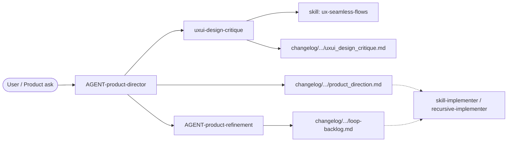
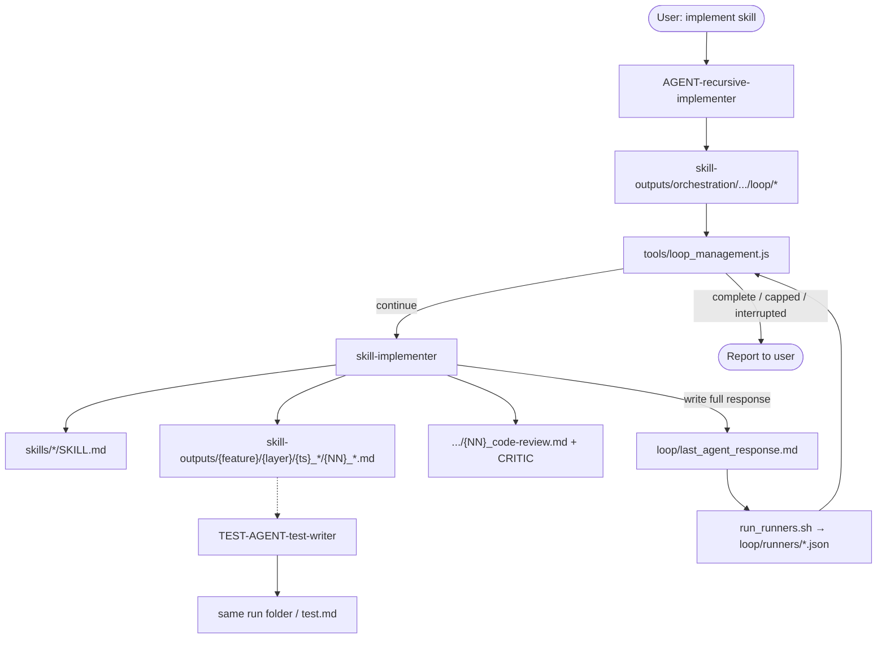
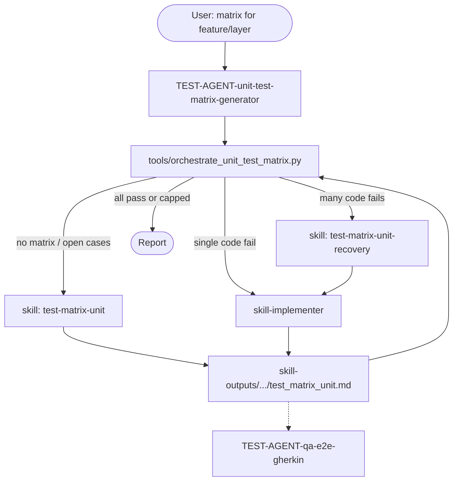
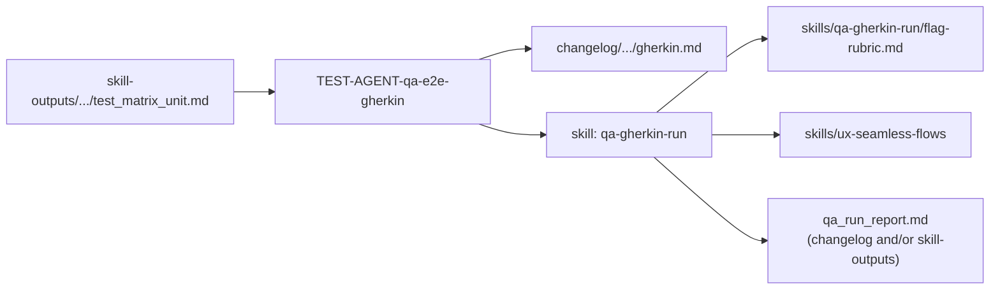
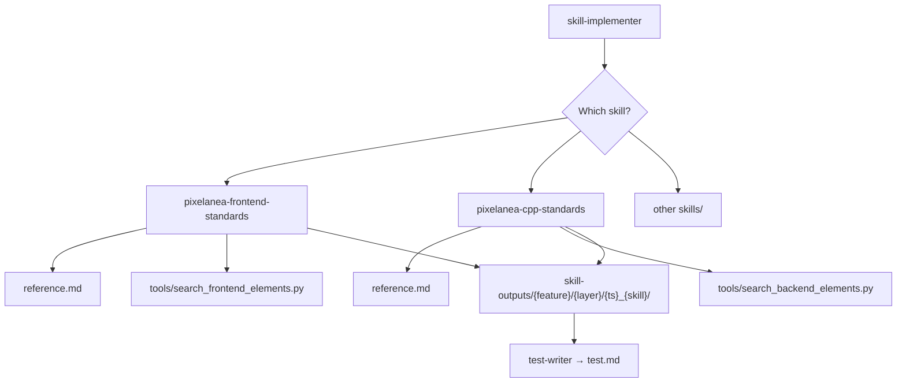
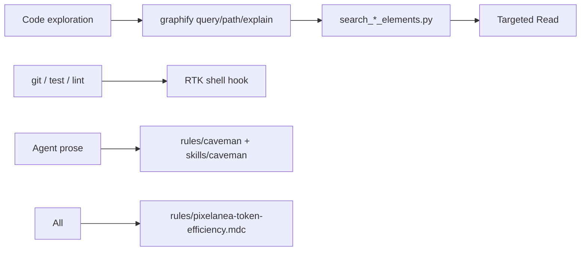

# Pixelanea Cursor Harness

The **Cursor harness** is Pixelanea’s in-repo system for running multi-step agent work without relying on chat memory alone. Agents, skills, rules, and decision scripts live under `.cursor/`. Durable outputs land in `skill-outputs/` (delivery) or `changelog/` (product/QA narrative). Mechanical continue/stop decisions come from scripts in `tools/`, not from the model guessing “are we done?”

**Why it exists**

- One agent turn is unreliable for investigate → plan → implement → review, or for “run tests until green.”
- Context resets between sessions; files under `.cursor/` are the shared memory.
- “Done” must be checkable (CI runner JSON under `loop/runners/`, matrix Status cells) so supervisors can loop safely with a cap. Cap ≠ complete.

**Roles at a glance**

| Role | Examples | Responsibility | Must not |
|------|----------|----------------|----------|
| **Supervisor** | recursive-implementer, unit-test-matrix-generator, product-director | Lifecycle, delegation, user report | Implement product code inline |
| **Worker** | skill-implementer, test-matrix-unit, qa-gherkin-run | Execute a skill / produce artifacts | Decide whether another iteration is needed |
| **Decision script** | `loop_management.js`, `orchestrate_unit_test_matrix.py` | Parse artifacts → JSON continue/stop or next action | Write product code or prose “judgment” |
| **Always-on rules** | `graphify.mdc`, `pixelanea-core.mdc`, … | Constrain every agent turn | Be bypassed because “files already known” |

**Formal contracts:** [docs/recursive-agent-loop-spec.md](docs/recursive-agent-loop-spec.md)  
**Path layout:** [.cursor/rules/skill-output-structure.mdc](.cursor/rules/skill-output-structure.mdc)  
**Setup:** `pnpm agent-tools:setup` (graphify venv, related tooling)

---

## Folder map

```text
.cursor/
  agents/           # Task subagent definitions (orchestrators + workers)
  skills/           # Playbooks agents must follow (SKILL.md + templates/refs)
  rules/            # Always-on or glob-scoped constraints injected into context
  tools/            # Decision CLIs + layer search (machine-readable stdout)
  skill-outputs/    # Runtime delivery: steps, matrices, test.md, loop/ state
  changelog/        # Product/QA narrative: direction, backlog, critique, gherkin
  cursor-*-log.*    # Local prompt/cost telemetry (not part of product loops)
```

| Concern | Lives in | Must not live in |
|---------|----------|------------------|
| Loop state (`loop_config`, checks, iteration, last response) | `skill-outputs/.../loop/` | `tools/`, repo root, `apps/`, `server/` |
| Matrices, step files, `test.md` | `skill-outputs/` | Source trees; prefer not only in chat |
| Product direction, loop-backlog, UX critique, E2E gherkin | `changelog/` (gherkin may also sit beside a matrix) | Scattered one-off paths |
| Decision logic | `tools/*.js` / `tools/*.py` | Re-implemented ad hoc in chat each run |

**Path segments (skill-outputs)**

| Segment | Meaning | Example |
|---------|---------|---------|
| `{feature}` | Product area (kebab-case) | `editor`, `qa`, `orchestration` |
| `{layer}` | Code layer from agent-tools | `canvas`, `domain`, `shell` |
| `{timestamp}` | UTC `YYYYMMDDTHHMMSS` | `20260731T054200` |
| `{skill-name}` | Skill folder basename | `pixelanea-frontend-standards` |

---

## Workflows (artifact connections)

### 1 — Product direction (strategy room)

**Purpose:** Answer “what should we build / polish / ship next?” without the director inventing UX and feasibility alone.

**Flow:** Taylor (product-director) frames a chair brief, then convenes design and/or strategy in parallel when possible. Design always runs Maya+Leo together (`uxui-design-critique`). Strategy always runs Sam+Jordan together (`AGENT-product-refinement`). Taylor synthesizes into a single product narrative and points delivery agents at the next shippable step.



| Step | Actor | Writes / reads |
|------|-------|----------------|
| Frame question | product-director | Chair brief in chat; prior `changelog/` |
| Design critique | uxui-design-critique + ux-seamless-flows | `uxui_design_critique.md` |
| Feasibility + batches | product-refinement | `loop-backlog.md` (RICE, backend/frontend/both) |
| Synthesize | product-director | `product_direction.md` |
| Downstream | skill-implementer / recursive-implementer | Consumes direction/backlog (dashed edge) |

**Session types:** Vision only · Design review only · Strategy only · Full product review (both teams).  
**Output root:** `.cursor/changelog/{area}/{timestamp}_{agent}/`

---

### 2 — Recursive skill delivery

**Purpose:** Run a chosen skill end-to-end and **retry until Develop CI runners are green** (or hit `max_iterations`, default 5), without the supervisor rewriting code itself.

**Separation:** The supervisor owns the loop. The worker (`skill-implementer`) owns investigation, planning, code, and an optional critic. `run_runners.sh` writes `loop/runners/*.json` from real CI steps; `check_condition.sh` + `loop_management.js` decide continue vs stop from **those sensors**, not model prose. Cap ≠ complete.

**Develop vs Deliver:** recursive strokes use lint + unit (`./scripts/ci.sh 03-lint`, `04-typecheck`, `06-test-unit`, optional `09-test-backend-unit`). Playwright / `./scripts/ci.sh e2e` belongs to the Deliver QA gate — not every recursive stroke. Sensor catalog: [scripts/ci-steps/README.md](scripts/ci-steps/README.md).



**Default stop gate (Develop)** — `check_condition.sh` exit 0 only when required files under `loop/runners/` are green:

1. `lint.json` exit 0 (`03-lint` + `04-typecheck`)
2. `unit.json` exit 0 (`06-test-unit`; + `09-test-backend-unit` when `server/` is in scope)

Ignore `EVALUATION`, `STATUS: complete`, and critic phrases in `last_agent_response.md` for the stop bit. Optional `CRITIC: PASS|FAIL` feeds the **next** context after runner tails and never greens a red runner.

**Statuses:** `complete` | `continue` | `capped` | `interrupted` — encoded in decision JSON and `summary.json`.

**Per iteration (worker):** `01_investigation.md` → `02_plan.md` → implement step(s) → `{NN}_code-review.md` with **CRITIC: PASS|FAIL**. Full chat response is copied to `loop/last_agent_response.md`; then runners are refreshed before the decision script reads them.

**Templates:** copy from `skills/loop-management/*.template.*` into the run’s `loop/` folder on first materialization.  
**Optional follow-up:** test-writer adds `test.md` so humans/CI can re-validate without re-reading every step file.

---

### 3 — Unit test matrix lifecycle

**Purpose:** Turn a feature/layer into a **stable matrix**: every case has a Status (`[ ]` / `[x]` / `[!]` / `[~]` / `[-]`), failures get fixed in batches or one-shot, and the orchestrator stops when the decision script says complete.

**Why a script:** Status cells are the source of truth. `orchestrate_unit_test_matrix.py` classifies the matrix and returns the next Task target so the supervisor does not invent routing.



| Decision (script) | Meaning | Next action |
|-------------------|---------|-------------|
| `run_test_matrix_unit` | Missing matrix or unrun `[ ]` cases | Follow `test-matrix-unit` skill |
| `delegate_skill_implementer` | Single code-instability failure | Fix via skill-implementer, then re-check |
| `delegate_test_matrix_unit_recovery` | Multiple failures | Plan batches → skill-implementer → re-run matrix |
| `report_complete` | All `[x]` / `[-]` or iteration cap | Stop; report to user |

**Matrix location:** `.cursor/skill-outputs/{feature}/{layer}/{timestamp}_test-matrix-unit/test_matrix_unit.md`  
**Paint helper:** `sync_paint_matrix_status.py` can refresh Status/Notes from vitest JSON under `skill-outputs/qa/paint/` so matrix cells match real unit runs.

---

### 4 — QA E2E (matrix → Gherkin → flagged run)

**Purpose:** Promote unit/integration coverage into **user-visible flows** against the real stack (Vite UI + C++ API), then judge each scenario with UX flags (not only pass/fail).



| Stage | Actor | Detail |
|-------|-------|--------|
| Author | qa-e2e-gherkin | Map matrix IDs (HP/RACE/EDGE/ERR) to Gherkin; prioritize routing, races, edges; no fictional UI |
| Execute | qa-gherkin-run | Run scenarios (Playwright / project e2e scripts); do not rewrite specs unless asked |
| Flag | flag-rubric + ux-seamless-flows | red / yellow / green / white per scenario |
| Persist | both | `gherkin.md` + `qa_run_report.md` under changelog (and often skill-outputs) |

---

### 5 — Standards delivery (single skill stroke)

**Purpose:** Apply frontend or C++ project standards (or another skill) in one worker pass: investigate with graphify + layer search, plan, change code, score the review, persist steps.



**Always applied on every stroke:** `graphify.mdc`, `pixelanea-token-efficiency.mdc`, `pixelanea-core.mdc` (dependency direction), plus frontend globs when touching `apps/web`.  
**References:** `reference.md` beside each standards skill holds the long-form checklist; `SKILL.md` is the executable playbook.  
**For automatic retries until Develop runners are green:** wrap with recursive-implementer (workflow 2) instead of a single stroke.

---

### 6 — Token-efficiency stack (cross-cutting)

**Purpose:** Cut exploration and log noise so loops stay within context and cost budgets. Three layers compose; `pixelanea-token-efficiency.mdc` requires all of them.



| Layer | Tool | Saves |
|-------|------|-------|
| Code read | graphify (+ layer search) | Blind Grep/Read of the whole tree |
| Shell output | RTK (Cursor shell hook) | Verbose git/test/lint dumps |
| Prose | caveman rule/skill | Filler in chat and step Outcomes |

Orchestrators must pass the standard token-efficiency line into every worker Task prompt so subagents do not skip graphify.

---

## Canonical run-folder artifacts

### Delivery store — `skill-outputs/`

Root pattern:

```text
.cursor/skill-outputs/{feature}/{layer}/{timestamp}_{skill-name}/
```

Orchestration loops often use:

```text
.cursor/skill-outputs/orchestration/{feature}/{timestamp}_{orchestrator-name}/
  01_setup-loop.md          # optional
  loop/
    …
```

| Artifact | Producer | Detailed role |
|----------|----------|---------------|
| `{NN}_{step-slug}.md` | skill-implementer, standards skills | Atomic step record: **Goal** (one sentence), **Outcome** (decisions/changes, no code dumps), **Files** (paths touched). Numbered so a run is replayable in order (`01_investigation`, `02_plan`, …). |
| `{NN}_code-review.md` | skill-implementer | Critic review of the delivery; must include **CRITIC: PASS** or **CRITIC: FAIL** plus severity findings. Optional next-stroke context — not the stop sensor. |
| `test.md` | test-writer | Executable validation guide for the run folder: commands, expected UI/API signals, what “pass” means. Written only after inspecting real delivered code. |
| `test_matrix_unit.md` | test-matrix-unit | Living table of cases (happy path, race, edge, error) with Status cells the decision script parses. Updated after every matrix execution. |
| `gherkin.md` | qa-e2e-gherkin | Optional sibling of a matrix in skill-outputs; often mirrored under changelog for Playwright runs. |
| `qa_run_report.md` | qa-gherkin-run | Per-scenario pass/fail plus UX flag colors and short rationale. |
| `loop/loop_config.json` | loop-management / recursive-implementer | Machine config: check script path, response file path, `max_iterations`, reasons, optional `next_prompt`. Paths must stay under the same `loop/` directory. |
| `loop/check_condition.sh` | loop-management | Bash sensor: exit **0** = complete, **1** = continue, **2** = interrupted. Reads `loop/runners/*.json`; ignores EVALUATION / STATUS in `RESPONSE_FILE`. |
| `loop/runners/*.json` | `run_runners.sh` (only) | Plant sensors: `lint.json`, `unit.json`, optional `e2e.json`, `summary.json` + truncated logs. |
| `loop/stop_condition.md` | loop-management | Human one-liner documenting what exit 0 means (for reviewers and future agents). |
| `loop/last_agent_response.md` | orchestrator each iteration | Full worker stdout/prose for that stroke; **overwritten** each loop. Critic/context for the next stroke — not the stop sensor. |
| `loop/loop_iteration.json` | `loop_management.js` | Tool-managed iteration counter; enforces the cap (`status: capped`, never implies complete). |

**Step file discipline:** one concern per file; keep Outcomes concise and link paths. Chat may summarize; the folder is authoritative.

### Narrative store — `changelog/`

```text
.cursor/changelog/{area}/{timestamp}_{agent-or-skill}/
```

| Artifact | Producer | Detailed role |
|----------|----------|---------------|
| `product_direction.md` | product-director | Vision, trade-offs, personas, what ships next; synthesis of design + strategy outputs. |
| `loop-backlog.md` | product-refinement | Batched work (backend / frontend / both), RICE, risk–impact; input to implementers. |
| `uxui_design_critique.md` | uxui-design-critique | Structured Maya↔Leo dialogue and agreed recommendations (not raw chat). |
| `gherkin.md` | qa-e2e-gherkin | Authoritative E2E scenarios for Playwright against live app + API. |
| `qa_run_report.md` | qa-gherkin-run | Flagged execution results next to (or linked from) the gherkin source. |

**Changelog vs skill-outputs:** matrices and `loop/` stay in skill-outputs. Direction/backlog/critique prefer changelog. Gherkin/reports may appear in both when useful for discoverability.

---

## File catalog — `.cursor/`

### Root telemetry

| File | Description |
|------|-------------|
| `cursor-cost-log.json` | Machine-readable log of estimated Cursor usage/cost events for local analysis. Not consumed by orchestration scripts. |
| `cursor-cost-log.md` | Human-readable companion to the cost JSON. |
| `cursor-prompts-log.json` | Machine-readable archive of prompts exchanged in this environment. Debugging/audit only. |
| `cursor-prompts-log.md` | Human-readable companion to the prompts JSON. |

### `agents/` — Task subagents

Each file is a Cursor agent definition (YAML frontmatter + instructions). Invoked via the **Task** tool with the listed `subagent_type` / name. Supervisors should pass full context in the prompt (goal, paths, prior artifacts, token-efficiency line).

| File | Name / `subagent_type` | Description |
|------|------------------------|-------------|
| `AGENT-product-director.md` | `AGENT-product-director` | **Taylor — Product Director.** Chairs cross-functional sessions. Does not deep-impersonate specialists; delegates design to `uxui-design-critique` and strategy to `AGENT-product-refinement`, then writes `product_direction.md`. Use for vision, release readiness, or aligning UX with feasibility. |
| `AGENT-product-refinement.md` | `AGENT-product-refinement` | **Sam (PM) ↔ Jordan (Tech Lead)** dialogue. Turns chat/context into a prioritized, batched `loop-backlog.md` with RICE and risk–impact. Use for sprint/loop planning and scope cuts. |
| `AGENT-recursive-implementer.md` | `AGENT-recursive-implementer` | **Recursive delivery supervisor.** Materializes `loop/` + `runners/` under `skill-outputs/orchestration/…`, runs `loop_management.js` after each worker stroke, and auto-delegates `skill-implementer` while `continue_loop` is true (cap 5). Stops when Develop runners are green (`status: complete`) or on cap (`status: capped`). Does not implement product code itself. |
| `DEVELOPMENT-AGENT-skill-implementer.md` | `skill-implementer` | **Primary delivery worker.** Always confirms which skill to run, then executes four fixed steps (investigate → plan → implement → scored review), marks backlog In progress before coding, and writes numbered step files under skill-outputs. Marks documentation/backlog status as it goes. |
| `DESIGN AGENT-uxui-critics.md` | `uxui-design-critique` | **Maya (UX) ↔ Leo (UI)** critique orchestrator. Stages a structured dialogue grounded in `ux-seamless-flows` and project UX/DESIGN docs; persists `uxui_design_critique.md` under changelog. Use for shell polish, wizards, onboarding, microcopy, hierarchy. |
| `TEST-AGENT-unit-test-matrix-generator.md` | `TEST-AGENT-unit-test-matrix-generator` | **Matrix lifecycle supervisor.** On every invocation runs `orchestrate_unit_test_matrix.py` and auto-delegates to test-matrix-unit, skill-implementer, or test-matrix-unit-recovery per JSON. Owns discovery → execute → recover → re-test until stable or capped. |
| `TEST-AGENT-qa-e2e-gherkin.md` | `TEST-AGENT-qa-e2e-gherkin` | **QA E2E author.** Reads `test_matrix_unit.md`, maps case IDs to real UI/API flows, writes Playwright-oriented `gherkin.md`, then hands execution/flagging to `qa-gherkin-run`. Refuses fictional screens or endpoints. |
| `TEST-AGENT-test-writer.md` | `TEST-AGENT-test-writer.md` | **Validation guide writer.** Scans skill-outputs run folders missing `test.md`, inspects the delivered code those steps claim, and writes runnable how-to-prove guides. Proactive after skill-implementer runs. |

### `rules/` — Always-on / scoped constraints

Rules are injected into agent context by Cursor. `alwaysApply: true` means every turn; others activate on path globs.

| File | Apply | Description |
|------|-------|-------------|
| `graphify.mdc` | always | **Mandatory orientation.** Before Read/Grep/Glob for codebase exploration, run `graphify query` / `path` / `explain`. After code edits, refresh with `graphify update`. Applies to subagents too. |
| `pixelanea-token-efficiency.mdc` | always | **Read / shell / prose cascade:** graphify → layer search → targeted Read; prefer RTK for git/test/lint; terse chat and step Outcomes. Orchestrators must inject the token line into worker prompts. |
| `pixelanea-core.mdc` | always | **Architecture law:** `apps/web` → OpenAPI client → `server/api` → `domain` ← `db`/`export`/`image`. Domain stays pure. Points at single sources of truth (OpenAPI, migrations, DESIGN tokens) and SOLID/DRY summaries. |
| `pixelanea-agent-tools.mdc` | always | **When to call layer search** (`search_frontend_elements.py` / `search_backend_elements.py`) vs blind grep; documents layers, flags (`--min-similarity`, `--max-matches`), and forbids editing tools for one-off searches. |
| `skill-output-structure.mdc` | always | **Where artifacts go:** feature/layer/timestamp layout, fixed canonical names, `loop/` subfolder rules, what belongs in changelog vs skill-outputs. |
| `caveman.mdc` | always | **Terse chat mode** (drop filler/articles/hedging; keep technical accuracy). Intensity via `/caveman`; auto-clarity for security/irreversible actions. |
| `pixelanea-frontend.mdc` | `apps/web/**` | Frontend architecture, editor shell layout, and DESIGN/UX expectations when editing the web app. |
| `pixelanea-frontend-antipatterns.mdc` | `apps/web/**/*.{ts,tsx}` | Concrete React 19 + Zustand pitfalls that cause blank screens or layer violations; warn during web edits. |

### `skills/` — Playbooks

Skills are the **procedures** workers must follow. Agents read `SKILL.md` (and `reference.md` when present) instead of improvising process.

| Path | Description |
|------|-------------|
| `caveman/SKILL.md` | Explicit caveman skill: intensity levels (`lite` / `full` / `ultra` / wenyan variants), when to trigger (`/caveman`, “be brief”), measured token savings intent. Complements the always-on caveman rule. |
| `loop-management/SKILL.md` | How to create a generic orchestration loop: materialize `loop/` under skill-outputs, define bash stop check + config, run `loop_management.js` after each agent response, act on JSON. Used by recursive-implementer and any custom supervisor. |
| `loop-management/loop_config.template.json` | Starter JSON for `loop/loop_config.json` (name, paths, caps, reasons, `next_prompt`). Copy and fill; keep paths repo-relative under the same `loop/`. |
| `loop-management/check_condition.template.sh` | Starter bash script that reads `loop/runners/` via `check_runner_gate.js` (exit 0/1/2). |
| `loop-management/stop_condition.template.md` | Starter one-sentence human definition of “done” for reviewers and future agents. |
| `pixelanea-frontend-standards/SKILL.md` | Executable frontend standards playbook: shell layout, canvas/tools, tokens, UX flows, SOLID/DRY for `apps/web`. Mandates graphify + frontend layer search before investigation. |
| `pixelanea-frontend-standards/reference.md` | Long-form frontend standards checklist and patterns referenced by the skill (ARCHITECTURE/DESIGN/UX distilled). |
| `pixelanea-cpp-standards/SKILL.md` | Executable C++/server standards playbook: domain purity, repositories, API handlers, image/export, CMake. Mandates graphify + backend layer search. |
| `pixelanea-cpp-standards/reference.md` | Long-form C++/server standards and architecture rules for reviewers and implementers. |
| `test-matrix-unit/SKILL.md` | Build and execute unit/integration matrices (happy path, race, edge, error). Creates/updates `test_matrix_unit.md` Status cells; escalates code failures to skill-implementer or recovery. |
| `test-matrix-unit/test_matrix_unit.template.md` | Markdown template for a new matrix (sections, ID conventions, empty Status cells). |
| `test-matrix-unit-recovery/SKILL.md` | After multiple matrix failures: plan mode, batch by layer/dependency, delegate each batch to skill-implementer, re-run matrix, update statuses. Never patches product code inline in the matrix chat. |
| `qa-gherkin-run/SKILL.md` | Execute authored Gherkin against the live app; record pass/fail; classify UX flags. Does not rewrite `gherkin.md` unless asked. Uses RTK for test output. |
| `qa-gherkin-run/flag-rubric.md` | Definitions for red/yellow/green/white flags tied to ux-seamless-flows rubrics so runs stay consistent across sessions. |
| `qa-gherkin-run/qa_run_report.template.md` | Template structure for `qa_run_report.md` (scenario table, flags, notes). |
| `ux-seamless-flows/SKILL.md` | Top UX practices for seamless flows (friction, hierarchy, continuity). Consumed by design critique and QA flagging; complements UX.md/DESIGN.md. |

### `tools/` — CLIs (stdout for machines)

Tools print a human banner on **stderr** and structured results on **stdout**. Orchestrators must parse stdout. Do not edit these scripts for one-off searches—pass different queries/flags instead.

| File | Description |
|------|-------------|
| `loop_management.js` | Generic loop decision layer. Optionally runs `run_runners.sh`, then `check_condition.sh`, updates `loop_iteration.json`, and prints JSON (`continue_loop`, `status`, `action`, `reason`). Statuses: complete / continue / capped / interrupted. |
| `orchestrate_unit_test_matrix.py` | Matrix decision layer. Locates or accepts a `test_matrix_unit.md`, classifies Status cells (`[ ]` `[x]` `[!]` `[~]` `[-]`), and prints the next orchestration decision + suggested subagent/skill. Drives the unit-test-matrix-generator agent. |
| `search_frontend_elements.py` | Fuzzy symbol search scoped to an `apps/web/src` layer (`shell`, `canvas`, `state`, …). Prefer after graphify when the layer is known but the file is not. `--list-layers` for the catalog. |
| `search_backend_elements.py` | Same idea for `server/` layers (`domain`, `db`, `api`, `export`, `image`, …). Aliases like `handlers` → `api`. |
| `sync_paint_matrix_status.py` | Paint-matrix helper: runs vitest (or reads JSON), maps `[HP-001]`-style IDs to Status/Notes in the paint `test_matrix_unit.md`. Keeps the living matrix aligned with automated unit results — do not treat unchecked agent `[x]` as lint/unit green. |
| `run_runners.sh` | Writes `loop/runners/{lint,unit,e2e,summary}.json` from `./scripts/ci.sh` steps (Develop or Deliver profile). |
| `check_runner_gate.js` | Reads runner JSON; exit 0/1/2 for the conjunction. Ignores markdown EVALUATION / STATUS. |
| `run_skill_output_smoke.py` | CI/local gate: reads [`.cursor/ci-smoke-manifest.txt`](../ci-smoke-manifest.txt), runs `test.md` **Automated** bash blocks and verifies matrix Status cells (no open `[ ]` / `[!]`). |

### `skill-outputs/` — Runtime delivery store

**Generated per run** — not a fixed checklist of product files. Top-level feature directories currently include e.g. `editor`, `qa`, `product`, `orchestration`, `foundation`, `distribution`, `performance`, `import`, `export`, `server`, …

```text
.cursor/skill-outputs/{feature}/{layer}/{YYYYMMDDTHHMMSS}_{skill-name}/
  01_investigation.md
  02_plan.md
  03_….md
  NN_code-review.md
  test.md                 # often added later by test-writer
  test_matrix_unit.md     # matrix runs
  loop/                   # orchestration / loop-management only
```

Treat the newest timestamped folder for a feature/layer as the working set unless a path is named explicitly.

### `changelog/` — Narrative / QA store

**Generated per product or QA session.** Areas currently include e.g. `editor`, `distribution`, `desktop-shell`, `desktop-linux`, `mvp`, `product`, `server`, `server-api`, …

```text
.cursor/changelog/{area}/{YYYYMMDDTHHMMSS}_{agent-or-skill}/
  product_direction.md | loop-backlog.md | uxui_design_critique.md
  gherkin.md | qa_run_report.md
```

Use changelog when the artifact is meant for humans planning releases or running E2E; use skill-outputs when the artifact feeds another agent loop (matrix Status, loop sensors, step chains).

---

## Fast path (when **not** to loop)

Use the full harness (recursive-implementer + `loop_management.js` + Develop runners) for multi-file features, cross-layer work, or anything that must pass lint+unit runners before merge.

**Use the fast path** — single `skill-implementer` stroke or direct edit + lint — when **all** of these hold:

| Signal | Example |
|--------|---------|
| One file (or docs-only) | typo, comment, `HARNESS.md` section |
| No API / schema / bundle change | no OpenAPI, migrations, manifest |
| No new user-visible behavior | copy tweak, rule wording |
| Proof = lint or one command | `pnpm lint`, `vitest run one-file` |

**Do not** spawn recursive-implementer for the rows above — loop overhead exceeds delivery size.

| Fast path | Tooling |
|-----------|---------|
| Docs / rules / harness | Edit + `pnpm lint` or `pnpm run lint` |
| Single-module fix | `skill-implementer` once (no loop folder) |
| Post-delivery proof | `test.md` in the skill run folder, or canonical CI smoke (below) |

When in doubt: if the task fits in one PR hunk and one test command, skip the loop.

---

## CI smoke for skill outputs (Batch 3 gate)

Durable proof lives in runner JSON and matrices, not chat EVALUATION scores. CI runs a **light manifest** — not a full agent loop.

| Piece | Path |
|-------|------|
| Manifest | [`.cursor/ci-smoke-manifest.txt`](.cursor/ci-smoke-manifest.txt) |
| Runner | [`scripts/run-skill-output-smoke.sh`](../scripts/run-skill-output-smoke.sh) → [`.cursor/tools/run_skill_output_smoke.py`](.cursor/tools/run_skill_output_smoke.py) |
| CI step | `scripts/ci-steps/14-skill-output-smoke.sh` (GitHub Actions `build` job, after unit tests) |
| Local | `pnpm test:skill-smoke` or `./scripts/ci.sh fast` |

**Manifest entry types**

| Type | Gate |
|------|------|
| `test-md` | Run bash blocks under `## Automated` in the listed `test.md` (skips `cargo` when Rust toolchain absent) |
| `matrix` | Fail if any case Status is `[ ]` or `[!]` |

After a shippable skill run becomes the regression anchor for a feature, add or replace its path in the manifest. Keep the list short (1–3 entries).

---

## Graphify hygiene

Graphify is mandatory for exploration, but broad queries return noisy hubs (`string`, `json`, package.json keys) that waste context.

| Practice | Why |
|----------|-----|
| Start with `graphify query "<specific question>" --budget N` | Avoid 200-node truncations |
| Use `graphify path A B` / `explain concept` for traces | Narrower than BFS from generic terms |
| Prefer layer search when the layer is known | [`search_*_elements.py`](tools/search_frontend_elements.py) |
| Run `pnpm graphify:update` after code edits | Keeps AST graph current (no API cost) |
| Ignore generic community hubs in `GRAPH_REPORT.md` | Hubs ≠ architecture; follow EXTRACTED edges to real files |

If orientation still fails after a narrowed query, read the identified file directly — do not re-run the same broad query with a higher budget.

---

## Quick “who owns what?”

| Goal | Start here | Decision tool | Primary artifacts |
|------|------------|---------------|-------------------|
| Product vision / release narrative | `AGENT-product-director` | — | `changelog/.../product_direction.md` |
| Prioritized shippable batches | `AGENT-product-refinement` | — | `changelog/.../loop-backlog.md` |
| UX/UI critique of a flow | `uxui-design-critique` | — | `changelog/.../uxui_design_critique.md` |
| Implement a skill until quality gate | `AGENT-recursive-implementer` | `loop_management.js` | `orchestration/.../loop/` + worker `{NN}_*.md` |
| One-shot skill delivery (no auto-retry) | `skill-implementer` | — | `skill-outputs/.../{NN}_*.md` |
| Fill missing validation guides | `TEST-AGENT-test-writer` | — | `skill-outputs/.../test.md` |
| Drive matrix to all-pass | `TEST-AGENT-unit-test-matrix-generator` | `orchestrate_unit_test_matrix.py` | `test_matrix_unit.md` |
| E2E Gherkin + UX flags | `TEST-AGENT-qa-e2e-gherkin` → `qa-gherkin-run` | — | `gherkin.md`, `qa_run_report.md` |
| Locate UI/server symbols by layer | (any agent) | `search_*_elements.py` | JSON matches on stdout |
| Custom continue/stop loop | `loop-management` skill | `loop_management.js` | `skill-outputs/.../loop/*` |

---

## Related docs (outside `.cursor/`)

| Path | Role |
|------|------|
| [docs/recursive-agent-loop-spec.md](docs/recursive-agent-loop-spec.md) | Formal loop architecture, bash/JSON contracts, anti-patterns, reference recursive algorithm |
| [PRACTICES.md](PRACTICES.md) | Engineering practices summarized by `pixelanea-core.mdc` |
| [ARCHITECTURE.md](ARCHITECTURE.md) | System layers skills and rules enforce |
| [DESIGN.md](DESIGN.md) / [UX.md](UX.md) | Visual system and personas/flows for design + QA skills |
| [BACKLOG.md](BACKLOG.md) / [CHANGELOG.md](CHANGELOG.md) | Product backlog and shipped history (agents keep status in sync when delivering) |
