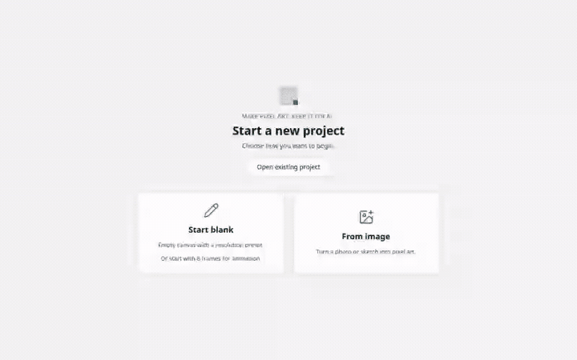

# Pixelanea

**Make pixel art. Keep it local.**

Free, open-source, local-only pixel art editor. Draw on a grid, pixelate photos, animate in 8/16/32 frames, and share a single `.pixelanea` project file — no accounts, subscriptions, or cloud required.

## See it in action

Demos use a real photo imported at 64×64, with procedural shadow shading and frame-by-frame horizontal animation (Select → Copy → Paste → nudge per frame).

| New blank project | Import & pixelate | Shadow + walk cycle |
|:---:|:---:|:---:|
|  |  |  |

Regenerate demos locally: `./scripts/record-linkedin-media.sh` (outputs GIFs only; video intermediates are not committed or packaged).

## Features

- **Two front doors** — start from a blank canvas or import an image through the pixelate wizard
- **Drawing tools** — paint, eraser, eyedropper, fill bucket, and line tool
- **Palette editor** — add/edit colors, presets (Retro, Gameboy, Monochrome), palette lock, procedural shading ramps (under **More tools**)
- **Undo / redo** — client-side command stack (500 steps) with Ctrl+Z / Ctrl+Shift+Z
- **Animation** — duplicate to 8/16/32 frames, frame copy/reorder, play/pause with FPS and loop
- **Project I/O** — native file pickers for save/open; asset types (Character, Prop, Background, Animation)
- **Save trust** — status bar shows saved / unsaved / saving; connection banner when the API is unreachable
- **Export** — File → Export: PNG (current frame), spritesheet (all frames), GIF animation
- **Animation aids** — onion skin toggle when working with multiple frames
- **Themes** — light/dark with OS preference; keyboard shortcuts overlay (`?`)
- **Accessibility** — icon + label tools, focus rings, `prefers-reduced-motion`

## Stack

| Layer | Tech |
|-------|------|
| Frontend | React, Vite, TypeScript, Tailwind (`apps/web`) |
| Backend | C++17, cpp-httplib, SQLite (`server/`) |
| Desktop shell | Tauri 2 + WebKitGTK (`apps/desktop/`) |
| Contract | OpenAPI → TypeScript client (`contracts/`, `packages/api-client`) |

## Desktop install (recommended)

**End users (workshops):** install the `.deb` from [Releases](https://github.com/pixelanea/pixelanea/releases) — it ships `pixelanea-shell`, a native window backed by WebKitGTK (no browser chrome). Launch **Pixelanea** from the app menu or run `pixelanea`. Optional: `sudo apt install zenity` for native File Open/Save dialogs. Fallback: `pixelanea-browser` opens the editor in your default browser.

**Developers (browser launcher, no Rust required):**

```bash
./scripts/install-desktop-linux.sh
pixelanea
```

**Developers (native shell):** install Rust stable + WebKitGTK dev packages ([DEPENDENCIES.md](./DEPENDENCIES.md)), then `pnpm build:desktop-shell` or `pnpm package:deb` for a `.deb` in `dist/`. `pnpm package:desktop` builds a portable `.tar.gz` (shell primary, browser fallback). Build artifacts are gitignored — never commit `dist/`.

See [docs/user-guide.md](./docs/user-guide.md) and [docs/workshop/teacher-guide.md](./docs/workshop/teacher-guide.md) for install details.

## Developer quick start

**Prerequisites:** Node 20+, pnpm 9+, CMake, C++17 compiler, vcpkg — see [DEPENDENCIES.md](./DEPENDENCIES.md).

```bash
pnpm install
pnpm generate:api
pnpm dev
```

| Service | URL |
|---------|-----|
| Web UI (developer) | http://localhost:5173 |
| API health | http://127.0.0.1:8787/api/health |
| Desktop app (browser launcher) | http://127.0.0.1:8787 (after `install-desktop-linux.sh`) |
| Desktop app (native shell) | `pixelanea-shell` / app menu after `.deb` install |

**Sample projects** for testing File → Open: [`examples/projects/`](./examples/projects/) (blank canvas, sprites, animations).

## Tests

```bash
# Fast feedback (seconds–minutes)
pnpm lint
pnpm typecheck
pnpm test:unit
pnpm test:qa

# Full smoke gate (install, build, live server checks)
pnpm test:smoke
pnpm test:smoke:frontend   # frontend smoke only
pnpm test:smoke:backend    # backend smoke only

# Desktop packaging
pnpm test:package:linux    # .deb structure (+ optional --docker)
pnpm test:desktop-shell    # shell subprocess smoke

# Backward-compatible aliases
pnpm test                  # same as test:smoke

# Playwright E2E (@smoke + @routing — requires Chromium)
pnpm test:e2e:install   # first time only
pnpm test:e2e

# Sprint 1 local gate (tsc + QA matrices + unit + optional E2E + backend)
./scripts/ci-sprint1.sh
```

CI runs `typecheck`, `lint`, `test:qa`, `test:unit`, backend tests, and smoke scripts on every PR — see [`.github/workflows/build.yml`](.github/workflows/build.yml). Tagged releases build `.deb` and `.tar.gz` artifacts — see [`.github/workflows/release.yml`](.github/workflows/release.yml).

## Documentation

| Doc | Description |
|-----|-------------|
| [docs/README.md](./docs/README.md) | Documentation index |
| [docs/user-guide.md](./docs/user-guide.md) | End-user walkthrough |
| [docs/shortcuts.md](./docs/shortcuts.md) | Keyboard shortcuts reference |
| [docs/workshop/teacher-guide.md](./docs/workshop/teacher-guide.md) | Classroom workshop guide |
| [docs/adr/](./docs/adr/) | Architecture decision records |
| [ARCHITECTURE.md](./ARCHITECTURE.md) | System design and layer boundaries |
| [UX.md](./UX.md) | User flows and personas |
| [DESIGN.md](./DESIGN.md) | UI tokens and layout |
| [DEPENDENCIES.md](./DEPENDENCIES.md) | Install and dependency pinning |
| [BACKLOG.md](./BACKLOG.md) | Active roadmap and done items |
| [CONTRIBUTING.md](./CONTRIBUTING.md) | How to contribute |

## Project layout

```text
pixelanea/
├── apps/
│   ├── web/               # React editor
│   └── desktop/           # Tauri shell (pixelanea-shell)
├── server/                # C++ API + SQLite + bundle I/O
├── contracts/             # OpenAPI spec
├── packages/api-client/   # Generated TS client
├── e2e/                   # Playwright E2E specs
├── examples/projects/     # Sample .pixelanea files for File → Open
├── brand/                 # Logo and color assets
├── docs/                  # User, workshop, and ADR guides
└── scripts/
    ├── dev.sh             # Start API + Vite with proxy
    ├── build-desktop-shell.sh
    ├── package-deb.sh     # Debian installer
    ├── package-desktop-linux.sh
    ├── ci-sprint1.sh      # Sprint 1 quality gate
    └── e2e-webserver.sh   # Stack for Playwright
```

## Status

Core editor, export, animation, and **Linux desktop shell** (Tauri + `.deb`) are complete on `main` — see [CHANGELOG.md](./CHANGELOG.md) Unreleased. Active post-v1 work (Windows shell, workshop PDF kit) is tracked in [BACKLOG.md](./BACKLOG.md).

## License

License: MIT — see [LICENSE](./LICENSE).
