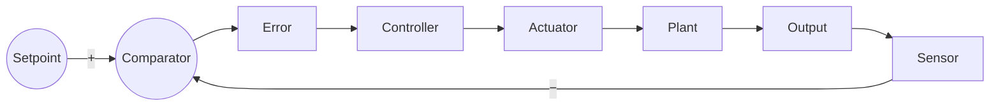
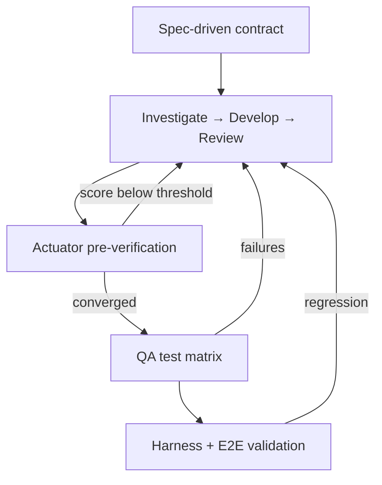

# Loop Engineering as a Control Loop

*LinkedIn article draft — testing a hypothesis*

---

**Hypothesis:** AI-assisted development becomes stable when you treat it like control engineering — measuring output, correcting on error, and iterating until the system converges on a defined setpoint. Not when you treat it like a one-shot API call.

I tested this building **Pixelanea**, a local-only desktop pixel art editor — React canvas on the front, C++ server on the back, native shell wrapping both. The kind of project where a single prompt can fix a brush tool and quietly break frame sync three layers away.

---

## Open loop feels productive. It isn't stable.

You prompt. The model writes code. You run tests. Something breaks. You prompt again.

That is open-loop engineering. No memory of the last measurement. No shared definition of done. You are the thermostat, the sensor, and the actuator — reading diffs at midnight, rerunning suites by hand, deciding whether to stop or push one more time.

It works until it doesn't. Then the room starts swinging: too hot, too cold, worse than when you started.

---

## You already know closed-loop control

**The thermostat.** You want 22°C. The room is 26°C. The AC runs. It overshoots. The heater corrects. Each cycle narrows the gap between *where you want to be* and *where you are*. Measurement, comparison, correction — repeat until error is small enough.

**Cruise control** is the same idea on a highway. You don't floor the accelerator once and hope. The system senses speed, compares to the target, adjusts throttle in small steps, senses again. Gentle corrections. Constant feedback. Stop adjusting when you arrive.

**What open loop looks like:** blasting the AC for ten minutes because it felt hot once, then leaving the house. Action without feedback. Chaos dressed up as progress.

---

## A multi-stack app is a chaotic plant

Pixelanea was my test rig for the hypothesis. Paint on a canvas. Undo cells. Animate frames. Save everything into a portable project file. Entirely offline — no cloud to hide behind.

As a *plant* in control terms, it is messy by design: a UI layer that must never touch the database directly, a C++ layer that owns persistence and image processing, a desktop shell gluing them together over localhost. The two halves do not share a language — they share a **contract**. An OpenAPI spec that defines every endpoint, every payload, every error shape. The UI consumes a generated client from that spec and nothing else. That is not bureaucracy. In control terms, it is the **reference signal**: the drawing on the wall that says what "correct" looks like before anyone starts correcting.

Without that reference, every iteration argues about what done means. With it, error becomes measurable — the implementation either matches the contract or it does not.

Disturbances still come from everywhere. A canvas fix ripples into frame sync. An agent declares victory while three test cases are still red. Chat context resets and iteration four has amnesia about what iteration two broke.

Left unstructured, the system **oscillates**. Ship, regress, patch blindly, introduce new bugs, burn out the human who was acting as the only feedback controller.

That is not a model intelligence problem. It is a **missing feedback path** problem.

---

## The loop: measure, compare, correct

Control engineering stabilizes chaotic systems with one discipline:

> **Measure → compare to setpoint → correct → measure again.**

The **setpoint** is what "done" means — tests green, review threshold met, smoke scenarios passing. Not vibes. Not "the agent said it looks good."

The **sensor** is anything that reads the plant honestly: fast unit harnesses that simulate a user painting a pixel, slower checklists agents update row by row, end-to-end scenarios that exercise the full stack.

The **error** is simply the gap. Failed cases. Open review findings. Anything still between here and the setpoint.

The **actuator** is the LLM — it writes code, runs tests, proposes fixes. Powerful at *doing*. Unreliable at *knowing when to stop*.

The **controller** is the part almost everyone skips. Small deterministic scripts — not the model — that read the sensors, compute whether error went down, and return one structured decision: continue or stop. The LLM is the motor. The script is the pilot logic.

When error is non-zero, the signal moves forward: controller commands another correction, the actuator changes the plant, the sensor reads again, the loop closes. When error reaches zero, actuation stops. An iteration cap on the controller acts as **anti-windup** — if the system cannot converge in five passes, it stops and reports residual error instead of spinning forever.

Three things make this work in practice. A **fixed setpoint** defined before the loop starts. **Sensors that live outside the chat** so context loss does not erase the last measurement. **Bounded corrections** so one wild actuator stroke cannot destabilize the whole plant.

---

## Wiring the plant: rails, workers, and foremen

Think of the Cursor harness as the instrumentation panel around the plant — not the product itself, but the thing that keeps corrections from becoming random.

**Rules** are rail guides. They do not close the loop, but they stop the actuator from tearing through load-bearing walls — layer boundaries, dependency direction, where artifacts must be stored so sensors always know where to look.

**Skills** are the instruction manuals hung on the actuator: how to investigate, how to run a test pass, how to recover from a batch of failures. They describe *how* one stroke of work happens. They never decide *whether* another stroke is needed.

**Worker agents** are the craftsmen — but a craftsman who ships without inspecting their own weld is just another disturbance source. Ours run a fixed **investigate → develop → review** stroke every time they touch the plant. First they map the territory: which layer owns the bug, what the contract says, what the architecture allows. Then they implement. Then they review their own work against a scored rubric and write it down.

That review step is **pre-verification at the actuator** — like a governor on a motor that will not release torque until inline checks pass. The worker is not trusted to declare done. Its output is a measurable artifact: a review score, open findings, an explicit completion marker. A bash comparator reads that artifact on the next loop pass. Below threshold? The controller sends the worker back in. No human triage required for the first cut.

This matters because it shrinks error *before* the expensive sensors fire. You are not waiting for a full QA pass to discover the actuator shipped slop.

**Supervisor agents** are the foremen. They do not weld. They read the controller's decision and send the right worker back in. Controller and actuator stay separate. If the foreman starts welding, you have lost the loop.

Two small scripts do the actual controlling. One is generic — a loop decision tool that runs a bash check against the last agent response and answers "are we done yet?" The other is domain-specific — a matrix orchestrator that reads a live checklist, counts failures, and routes either a single fix or a batched recovery. Prompts propose. Scripts dispose.

---

## Spec first, then pre-verify, then independently validate

Here is where the pipeline gets interesting — and where most agent setups skip straight to chaos.

**The contract is the setpoint for the whole stack.** Before a worker writes a line of UI code, the API shape already exists in the spec. Before a C++ handler ships, the same spec is the acceptance criteria. Gherkin scenarios — written from the same case IDs as the test harness — become the long-horizon setpoint for user-visible behavior. Spec-driven development is not a methodology poster on the wall. It is what makes the comparator meaningful. You cannot compute error without a reference.

**The investigate → develop → review actuator is the first closed loop — tight, fast, self-contained.** Think of it as cascade control's inner loop: correct locally before the outer loop even wakes up. The worker investigates so it does not fix the wrong layer. It develops against the contract so the change is structurally valid. It reviews so the actuator's own output is a sensor reading, not a press release. Only when that inner loop converges does the change earn the right to face independent measurement.

**The QA agent is the outer loop — and it does not trust the actuator's word.** After pre-verification, a separate QA agent lays out a test matrix: happy paths, race conditions, edge cases, error handling — every row a measurable claim drawn from the spec and from what the plant actually does. The matrix is not a post-mortem checklist. It is the instrument panel for long-run validation. Rows get marked pass or fail as cases execute. The orchestrator reads that panel and routes failures back to workers. Gherkin journeys and browser E2E sit beyond that — flight instruments confirming the whole stack in motion.

The sequencing is deliberate. Contract defines the reference. The actuator pre-verifies against it. QA independently proves it over time. Skipping any layer is how you get a system that *feels* stable for one iteration and diverges on the next.

---

## Fast sensors and slow sensors

Not every instrument belongs on the same dashboard — and none of them replace the contract or the actuator's self-review. They **confirm** what pre-verification claimed.

**Strain gauges** sit on the plant itself — Vitest harnesses that reset editor state, simulate a paint stroke, assert a pixel changed, all in milliseconds. They are the inner measurement loop after the actuator has already done its homework. They catch regressions before anyone boots a browser or compiles the server.

**Process charts** update slower — the QA test matrix an agent builds and executes row by row, a living checklist the orchestrator reads like a control room operator scanning gauges. When a row flips to failed, that is error registering against the spec — not against the worker's self-assessment. The controller sends a worker back in, not a guess.

**Flight instruments** come last — full user journeys against a running stack, UX quality flags, the kind of verification that confirms the plant behaves in the real world, not just in a mocked test cell.

Cascade control works the same way in a refinery: a tight inner loop corrects locally; a supervised outer loop validates the whole process against the engineering drawing. If your only sensor is the slowest one, you fly blind between checks. If you skip the inner loop, every disturbance hits the expensive instruments at once.

We ran 123 fast-sensor cases across paint, file I/O, import, and animation — each tagged so the same identifier traces from contract to harness to matrix to end-to-end scenario. One reference signal, four depths of proof.

---

## One disturbance, one correction cycle

Picture a race-condition failure: rapid frame navigation leaves sync stale.

The fast sensor catches it first — a harness case fails. The matrix row turns red. The orchestrator sees a single failure and dispatches a worker: investigate the sync path, develop a fix against the API contract, review the diff. The bash comparator reads that review: score below threshold, critical finding still open — still not done. Another investigate-develop-review pass. The harness re-runs. The matrix row turns green. Error zero. Controller stops.

If three related failures span canvas and API layers, the controller escalates — batched recovery, one layer at a time, matrix re-read after each batch. That is not thrashing. That is a supervisor choosing a larger correction stroke because the error signal is coupled across subsystems.

---

## What the hypothesis taught us

**Separate the pilot from the motor.** The model implements. Scripts decide. If one prompt does both, you are back to open loop with extra steps.

**Memory belongs in the sensors, not the chat.** Checklists, iteration counters, saved responses — anything that lets the next pass start from measured reality instead of reconstructed conversation.

**Define done before you start.** Ambiguous setpoints are how loops never converge. Write the stop condition in one sentence. Automate the comparison.

**Cap your iterations.** Infinite retry is not persistence. It is an unstable oscillator. Five passes, report residual error, let a human intervene. That is anti-windup for software.

**The harness is the nervous system.** Test helpers are not boilerplate. They are the minimum simulation of a user — the thing that lets you feel disturbances in the plant before the plant flies into a mountain.

**Contracts come before corrections.** Spec-driven setpoints — API shapes, Gherkin journeys, matrix case IDs linked together — are what make error computable. Without a reference, every loop iteration renegotiates the target.

**Pre-verify at the actuator, validate independently.** Investigate-develop-review shrinks error cheaply. QA matrices and E2E prove it honestly over the long run. Trusting the actuator's self-report without an outer loop is open-loop engineering with extra steps.

---

## Did it work?

Pixelanea shipped — a real desktop app, real bundles, real animation playback — built with agents that did not run open-loop.

Loop engineering did not replace engineering judgment. It replaced the ad-hoc human feedback path with something explicit: a setpoint humans define, sensors that tell the truth, controllers that decide, actuators that correct, limits that prevent runaway.

The hypothesis held: **treating AI development as a control problem turns a chaotic process into one that can converge.**

Power without feedback is noise. Build the sensors first. Write the comparator in bash. Let the agent be the motor, not the pilot.

---

*Pixelanea is an open-source, local-only pixel art editor. I built it in Cursor using this loop-engineering harness as an experiment in closed-loop agent orchestration.*

**#SoftwareEngineering #AIEngineering #ControlSystems #Cursor #TestAutomation**
